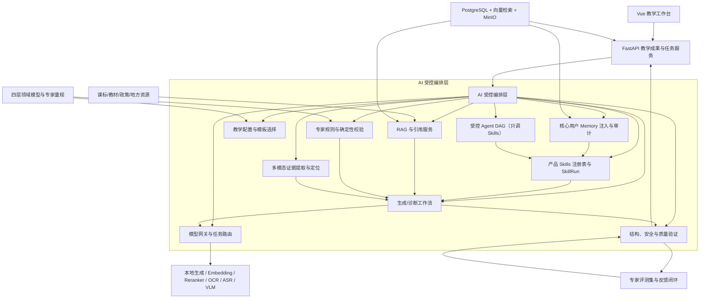
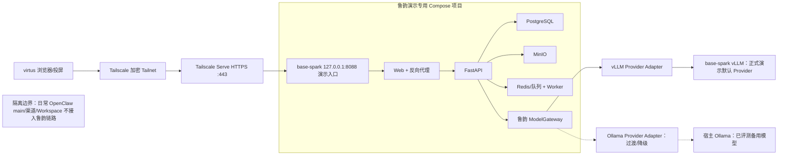

# 鲁韵思政大模型：教学与课程论驱动的分阶段开发计划

> - 版本：v1.2（在 v1.1 基础上新增 §0.5 自助开发模式；范围、阶段、验收门槛与禁止项零变更，仅调整执行方式，如有歧义以 v1.0 签字内容为准）
> - 日期：2026-07-17（v1.0 签字版日期 2026-07-15；v1.1 平实化修订 2026-07-16）
> - 状态：签字版 + 自助开发模式生效；客户与专家暂不参与期间，外部签字项按 §0.5 冻结为补签清单，工程按内部代理决策先行开发，G0/G1 外部签字仍为最终验收前提
> - 适用范围：鲁韵思政大模型的教学设计生产、教学设计诊断、产品 Skills、核心用户 Memory、受控多智能体、多模态、模型专项优化及投标演示部署；用户注册与身份认证能力规范见 §2.6，实现落点不在本仓库
> - 文档权威：合同范围、阶段、验收与工程顺序以本文为唯一主依据；其余产品/功能文档必须与本文对齐，冲突时以本文为准

## 0. 文档目的与结论

本计划的输入材料：

- 当前问答 MVP 与阶段 1A 首个可部署增量的代码、架构、测试和部署文档。
- `2026-product-extension-development-suggestions.md`（功能方向基础稿，非排期依据）。
- `2026-product-extension-feature-spec.md`（能力图/招标素材，非排期依据）。
- `2026-luyun-external-solution-v1.0.md` 与其发布件 `鲁韵思政大模型建设方案_v1.0_对外版.docx`。
- 上次客户汇报的核心反馈：产品必须体现“教学与课程论”体系，重点是教学设计生产和诊断的专业可信度。
- 2026-07-15 工程评审：纳入产品 Skills 与核心用户 Memory；确立纵向样板优先、阶段 4 能力门禁化、文档驱动开发等原则。
- 2026-07-15 用户体系决策：采用“注册用户 / 认证用户”两级；过渡期自助登记流程见 §2.6；实现于思政课平台用户管理，不在本代码仓库开发。
- 2026-07-15 签字前审计：小程序确认为合同硬交付，阶段 3 建设轻量端；补入合规适用性、生成内容标识、四库评测隔离、独立红队、Data/System Card、持续评测与 RTO/RPO。

客户的核心顾虑成立：单纯部署开源大模型做不了专业教学设计与诊断。本项目不采用“开源模型 + 一段长提示词 + 直接输出完整教案”的建设方式。

可靠的教学成果不来自单个模型，而来自这些组件的组合：权威课程知识、课程教学结构模型、专家规则、受控产品 Skills（工作流）、核心用户受控 Memory、经专项评测的本地模型，以及教师与专家反馈闭环。

核心产品目标：教师能在可信依据支持下，更快形成一份可解释、可局部修改、可诊断、可导出、可持续迭代的教学成果；中心能管理专业标准、资料、审核和质量，而不是只管理模型和问答次数。

### 0.1 本计划的核心决策

1. 产品主对象从“聊天会话”升级为“教学成果项目”（Teaching Project）。
2. 教学专业底座采用“课程层—单元层—课时层—实施反思层”四层对象模型。
3. 教学设计先生成目标、证据、任务和评价的对齐结构，再生成自然语言正文。
4. 教学诊断不输出总分和教师排名，只基于原文证据、专家规则和课程依据提出形成性建议；仓库内不建设教师/学生评分排名模块。
5. 合同范围覆盖阶段 0–4，以 G4 为最终验收门。阶段 4 交付受控多智能体、多模态与微调评估闭环，三者均为能力门禁式交付（可运行样板 + 评测 + 降级/No-Go）；不合格能力不为形式交付强行上线。
6. 正式环境和最终验收默认采用 vLLM 推理服务；Ollama 仅作前期开发、兼容性验证和明确标注的备用 Provider；业务代码不绑定任一推理引擎。
7. `base-spark` 采用集成环境与稳定演示环境双轨部署；每个可验收开发节点先完成部署、`virtus` 端到端验证和回滚检查，再晋级稳定演示版本。演示轨道不抢跑尚未完成的教学能力，不用原型冒充已实现后端。
8. 产品 Skills：教师任务以版本化、有 Schema、有权限与审计的受控技能暴露（检索依据、生成蓝图、诊断、导出等），不做开放插件市场或自由 Agent 工具箱；阶段 4 Agent 复用同一批产品 Skills。
9. 核心用户 Memory：为一线教师与专家建设显式、可删、可审计的教学工作记忆（偏好、班情档案、常用模板、成果上下文）；禁止思想侧写、能力评级与绩效画像；学生不做生成式 Memory。
10. 纵向样板优先：阶段 1–2 只打通一个学段/课型的完整闭环，不并行铺开十二大模块。工程顺序固定为：领域对象 → 服务层编排抽离 → 最小 ModelClient/Gateway → 异步任务 → RAG → 产品 Skills 运行时 → Memory 最小集 → 样板生成/诊断/导出。
11. 文档驱动开发：实现、验收、代理交付均以本文阶段工作包与决策门为准；`.github/skills` 仅服务工程动作，不构成第二套产品需求。
12. 用户身份两级制（平台侧实现）：完成手机号验证与姓名、工作单位自填后为注册用户；完成第 5 步权威源/组织侧升级后为认证用户。默认不采集未核验身份证号。注册/认证能力在思政课平台用户管理开发，**本仓库（sdszk-qa）不实现注册与 KYC**，仅消费平台下发的身份声明与会话。
13. 小程序为合同硬交付：阶段 3 建设轻量端，完成统一登录、可信轻问答、收藏/历史、通知和异步任务进度，并可跳转网页继续复杂编辑；完整备课工作台、Memory 全量管理和后台审核不进小程序。
14. 合规与安全是发布门：阶段 0 完成适用性矩阵、数据分类、生成内容标识、投诉纠错和备案/安全评估判断；阶段 1 起按 OWASP 风险面执行独立红队，不以普通功能测试替代。
15. 评测四库隔离：开发集、CI 回归集、密封验收集和线上事件集分权管理；训练、调参和开发人员不接触密封验收集。
16. 自助开发模式（2026-07-17 起）：客户与专家暂不参与期间，工程团队按 §0.5 以内部代理决策推进开发与内部验收；外部签字项整体冻结为补签清单，任何内部结论不得表述为客户确认或专家签字。

### 0.2 文档权威与阅读顺序

| 优先级 | 文档 | 用途 |
| --- | --- | --- |
| 1 | 本文 `2026-luyun-curriculum-pedagogy-development-plan.md` | 范围、阶段、验收、Skills/Memory、用户身份分级、工程顺序、非范围 |
| 2 | `ARCHITECTURE.md`、`src/infra/README.md`、`README.md` | 当前实现与部署基线（须标注已实现/目标） |
| 3 | `2026-product-extension-feature-spec.md` | 能力图与招标参数素材，**非排期** |
| 4 | `2026-product-extension-development-suggestions.md` | 方向讨论稿，**非排期** |
| 5 | `AGENTS.md`、`src/docs/DEVELOPMENT.md`、`.github/*` | 代理与工程交付约束 |

冲突处理：产品范围与验收以本文为准；实现细节以代码与架构说明为准，但不得把目标能力写成已实现。

`2026-luyun-external-solution-v1.0.md` 及对应 Word 是本文的对外表达版，不新增或变更范围；表述冲突时以本文签字版为准。

### 0.3 假设/待确认

- 假设：合同全周期主要用户是一线思政课教师、教研员和中心专家，不直接面向学生开放生成式对话。
- 已确认：合同建设范围覆盖阶段 0–4，包括受控多智能体、多模态和可能的微调，以 G4 作为合同最终验收门。
- 已确认：投标演示环境部署在 `base-spark`，由同一 Tailnet 内的 `virtus` 浏览器访问。
- 已确认：正式环境和最终验收默认采用 vLLM；`base-spark` 当前 Ollama 仅作过渡开发和备用 Provider，需在 D0 完成 GB10/arm64 上的 vLLM 专项验证。
- 已确认：开发过程按节点持续部署，`base-spark` 保留高频更新的集成环境和可随时演示的稳定环境，未经门禁不得用开发版本覆盖稳定演示版本。
- 已确认：产品 Skills 与核心用户 Memory 纳入阶段 0–4 开发计划（见 §2.5）；Memory 形态为工作记忆而非通用用户画像。
- 已确认：用户体系采用 §2.6 注册用户 / 认证用户分级；步骤 1–4 为注册用户，步骤 5 为认证用户；开发落点为思政课平台用户管理，不在本仓库实现。
- 已确认：过渡期不以“自填身份证号且不核验”作为实名；默认不采集未核验身份证号。
- 已确认：小程序属于合同硬交付，阶段 3 建设，边界为轻量访问和跨端续办，不承载完整桌面工作台。
- 假设：最终生产环境坚持校内部署，本地模型不得静默切换到外部服务；`base-spark` 仅作投标演示和研发验证环境，不替代客户生产验收环境。
- 待确认：山东师范大学信息中心可用 GPU、显存、CPU、内存、存储、备份和网络条件。
- 待确认：思政课平台用户管理的具体系统名、接口契约、token/claims 字段与本仓对接方式（见 §2.6.5）；现有平台的统一身份、组织、资源和审计接口与此合并推进。
- 待确认：教材、教参、中心资源及山东地方资源的数字化授权范围。
- 待确认：小学、初中、高中、大学四学段专家的参与方式及审核时限。
- 待确认：本计划中的周期和候选验收阈值需在阶段 0 基线完成后共同锁定。
- 待确认：投标演示日期、演示时长、必须现场展示的能力和评委是否只观看 `virtus` 投屏。
- 待确认：阶段 1 首批产品 Skills 清单的最终命名与客户话术（建议清单见 2.5.1）。
- 已确认（2026-07-17）：进入自助开发模式；客户、专家与资料授权相关决策暂缓，由内部代理决策先行并留痕待复核，详见 §0.5。
- 术语说明：本文“合同全周期”指阶段 0–4；“投标演示轨道”是贯穿全周期的独立交付轨道，不代表所有合同能力已经完成。

### 0.4 v1.0 签字前允许与禁止的工作

禁止：新业务接口与领域表迁移、新外部依赖引入、把目标能力做成半成品功能岛、以演示需要覆盖稳定环境。

允许（零业务污染或纯数据卫生）：

1. 修正种子案例文件名/内容错位及一致性校验脚本（不改变线上语义契约以外的脏数据）。
2. `routes/chat.py` 等现有逻辑抽到 `services/` 且行为与测试保持不变。
3. vLLM arm64/GB10 只读兼容性探针与模型资产登记表草稿。
4. 文档对齐、ADR 草稿、评测 JSON Schema 草案、产品 Skills 目录与 Memory 边界说明书。
5. 开发侧 `.github` skill 索引校准（不新增与产品冲突的评分类可执行 skill）。

### 0.5 自助开发模式（2026-07-17 策略调整）

背景：客户与四学段专家暂不参与项目，而阶段 1 剩余工作全部卡在外部输入（真实资料、专家金标、正式选型、外部签字）上。为避免开发停滞，自 2026-07-17 起进入自助开发模式。本节只调整执行方式；范围、阶段划分、G 门标准和全部禁止项不变。

执行规则：

1. **内部代理决策。** 原需客户/专家确认的输入（样板范围、成果类型、Word 模板、Skill 目录、诊断规则、评测阈值等）由项目负责人内部决定并立即生效；每项决策以"内部代理决策"字样记入对应阶段实施记录。外部参与恢复后逐项提交复核，允许被推翻并按台账替换。
2. **外部补签清单。** G0/G1 中需要客户或专家签字的条目整体冻结为补签清单（清单正文见《阶段 1 工程冻结基线》§8 与《阶段 1 模拟信息替换台账》§2），不再阻塞工程开发；G0、G1、阶段 1A/1B 的整体状态保持"未完成"，直至补签闭合。
3. **内部金标 v0。** 由工程团队自研 120–160 个案例，建成 `data_origin=synthetic` 的专用数据集（建议 key：`stage1-internal-gold`），用已上线的批量导入、双评、第三人仲裁工具走完整治理流程，并以其标定内部工程阈值。该集只用于工程回归、流程演练和阈值标定；禁止改名、改来源或改审核状态冒充 `customer_provided`/`expert_authored`。
4. **内部里程碑 M0-int / M1-int。** 与 G0/G1 条目一一对应的内部验收门：凡不涉及外部签字的条目按原标准执行，凡涉及外部签字的条目替换为对应内部代理产物（内部金标、内部阈值、内部走查）。通过 M-int 是继续下一阶段工程开发的依据，不等于通过 G0/G1。
5. **反虚报约束不变。** `CONTENT_MODE` 保持 `synthetic`；演示、文档和界面不得把内部代理决策、内部金标或内部阈值表述为客户确认、专家签字或专业验收；43/64 等工程命中率不得解释为教学质量指标。
6. **退出条件。** 客户或专家恢复参与后本模式收敛：按《阶段 1 模拟信息替换台账》§3 顺序替换模拟项，内部代理决策逐项复核，M-int 结果作为外部验收的输入而非结论。

自助开发优先级（阶段 1 内，按序推进，遵守"每周一个纵向增量"）：

1. **检索质量调优：** 分析 64 例模拟回归中 21 个 `failed` 的根因（分块、检索参数、Embedding/Reranker 配置），设定并达成内部命中率目标。
2. **内部金标 v0：** 自研案例扩充至 120–160 例，完成双评/仲裁全流程，产出《内部阈值标定报告 v0》。
3. **引用精细化：** 页码/段落级定位、资料有效期与资料不足策略（对应 §1.2 缺口）。
4. **诊断规则字典 v2（内部版）：** 把三个工程诊断维度扩展为可配置规则字典，保持非评分约束和防护测试。
5. **工作台体验：** 专业编辑体验、可用性走查与无障碍适配的内部版本。

## 1. 当前基线与建设差距

### 1.1 当前已实现能力

截至 2026-07-16，项目已从思政场景问答 MVP 前进到“问答兼容链路 + 阶段 1A 可部署增量”，具备：

- 本地账号登录、JWT 鉴权。
- 固定主题与自定义主题。
- 会话创建、历史会话和消息留存。
- 经最小 ModelClient 接入 Ollama 原生或 OpenAI 兼容 Provider 的 SSE 流式问答；当前 `luyun-int` 已固定使用 vLLM 工程候选主链，Ollama 仅保留为明示备用。
- 基础限流、Trace ID、结构化日志和操作审计。
- Vue 3 + Vant 网页端。
- PostgreSQL 17 + pgvector、MinIO、固定版本 vLLM 工程基线和 A/B 双机部署底座。
- Teaching Project / Version、Knowledge Document / Chunk、TaskRun、SkillRun 和 ModelCallAudit 基础对象及迁移。
- 问答编排服务层、最小 ModelClient（逻辑模型名、Provider 标识、超时、错误映射和调用审计）。
- 资料上传、后台解析、审核门禁、`pg_trgm + pgvector + Reranker` 语义混合检索、可追溯引用和 Provider 故障时的显式字符向量降级。
- 固定 vLLM 运行时镜像摘要、生成/Embedding/Reranker 模型 revision、逻辑服务名和数据库模型资产登记；当前资产仅为工程候选。
- 项目级知识索引版本、配置哈希、原子激活和失败版本留痕。
- 可版本化工程评测：数据集草稿/冻结、内容哈希、发布清单绑定、逐案例技术结果和运行留痕；正式来源案例支持批量导入、双专家独立复核、第三人仲裁、占位案例防冻结和汇总报告。
- 产品 Skills 运行时：统一执行入口、Schema/权限校验、停用/降级契约和运行留痕；当前注册六个工程样板 Skill。
- 核心用户 Memory：账户偏好、班情档案、项目/模板钉选、前端显式引用确认、注入审计、导出和一键清除。
- 项目、版本、资料、任务、生成、诊断、差异和导出的桌面优先工作台技术样板。
- 高中议题式纵向技术样板：课程依据对齐卡、目标—证据—任务蓝图、课时分块、非评分诊断、版本差异与 `word-standard-v2` 结构化 Word 导出；界面按前置成果逐级解锁。
- Memory 项目/模板钉选与前端显式注入确认；六个样板 Skill 均经统一 SkillRun 留痕。
- `base-spark` 的 `luyun-int` 集成 Compose、loopback 服务边界和 Tailscale Serve HTTPS；已从 `virtus` 验证登录与 SSE 问答，并以真实 Chromium 自动回归本轮工作台增量。

上述状态是实施快照，不改变本计划的范围、工作包和 G1 门槛。当前结论：**阶段 1 模拟工程闭环与双环境晋级可运行；阶段 1A、阶段 1B、G0 和 G1 整体均未完成。**

### 1.2 当前尚未具备的关键能力

- 统一身份、组织同步和完整角色权限（目标由思政课平台用户管理提供注册/认证分级，本仓对接消费；见 §2.6）。
- 课程标准、教材、政策和地方资源的完整可信 RAG（语义 Embedding/Reranker 工程链已实现；正式模型选型、资料授权、页码/段落定位和专业阈值尚未冻结）。
- 完整来源引用、页码/段落定位、资料有效期和资料不足策略（当前仅有片段级引用基线）。
- 经专家确认的课程层、单元层、课时层完整结构化教学成果（当前只有一个高中议题式技术样板）。
- 自由编辑、字段级局部重生成和可视化富文本差异（当前已有结构化版本差异和 Word 导出）。
- 经专家签字的完整诊断量规与规则字典（当前只有三个非评分工程诊断维度）。
- 专家签字的完整阶段 1 产品 Skills 目录、正式配额和质量策略（当前六个工程 Skill 已注册，但除 `retrieve_basis` 外仅标记 vertical_sample）。
- Memory 保留/删除 SLA 与授权共享模板（偏好、班情、钉选、前端注入确认、导出、清除和注入审计已实现）。
- 独立 Worker/队列、共享缓存、通用幂等、失败恢复和高峰降级（当前仅应用内后台资料任务、取消/重试和重启恢复基线）。
- 模型、提示词、规则、知识库、Skill 和成果版本的完整统一追溯（当前已有部分对象与调用审计）。
- 真实专家评测集、专业发布阈值和教师采用反馈（评测框架、批量导入、双评/仲裁工程门禁和 fixture 已实现，但尚无 120–160 个真实专家金标）。
- 完整桌面优先教学工作台（当前技术样板闭环已接通，专业编辑体验、可用性走查和无障碍适配未完成）。
- 管理端、审核流、资源库、阶段 3 小程序轻量端和区域运营看板。
- 受控多智能体任务状态、工具权限、预算和单工作流回退。
- 图片/音频/短视频的多模态证据定位、纠错、授权和删除。
- 微调数据流水线、冻结测试集及 Go/No-Go 验收。
- `base-spark` 的正式专业演示版本、完整演示降级包与 Virtus 人工验收（`luyun-demo` 模拟工程环境、同镜像晋级、备份恢复和应用回滚基线已完成）。
- 经专业评测冻结的标准模型资产清单、Provider 一致性回归和 `base-spark` 集成/稳定演示双环境晋级机制（固定资产登记与工程运行基线已实现）。

### 1.3 现有方案需要修正的方向

现有最终方案提出十二类模块，方向完整，但直接作为一期范围会产生以下问题：

- “已实现、一期承诺、后续愿景”边界不清。
- 教学设计生成和诊断主要以功能描述呈现，缺少统一的课程教学领域模型。
- 验收偏重“能否生成”，缺少专业正确性、证据充分性、教师采用和时间节省指标。
- 教案诊断被放在第二阶段，会导致一期只有“生成”而没有“修改闭环”。
- 多智能体、小程序、研修、资源管理和看板同时开工，会稀释核心体验。
- 没有显式的产品 Skills 与 Memory 设计时，系统会退回“长会话 + 隐式上下文”，无法审计、无法复用、难以验收。

因此，本计划把轻量诊断、局部修改、版本对比、标准导出、首批产品 Skills 与 Memory 最小集前置到阶段 1–2，再在阶段 3–4 扩展四学段、一体化和增强能力。

### 1.4 工程优化原则（v0.4）

1. 单一真相：排期与验收只认本文；功能规格/建议稿不得单独驱动迭代。
2. 每周一个纵向增量：任何 PR 默认服务当前样板闭环，否则进入 backlog。
3. 先对象后能力：没有 Teaching Project / Version / SkillRun / Memory 边界，不堆页面模块。
4. 先服务层后功能：阶段 1 启动时先把 LLM 调用与编排移出路由，不在 `chat.py` 上继续堆叠。
5. 演示不抢跑：D0–D3 只保证可访问与真实已实现能力；未完成能力必须标记为原型/预置。
6. 桌面优先工作台：备课/诊断/版本/导出以桌面网页为主；小程序在阶段 3 按轻量硬交付边界建设，不与阶段 1–2 核心闭环捆绑。
7. 数据卫生可前置：种子案例错位修正不阻塞 G0 专业讨论，但必须在 G0 关闭前完成。
8. 增强能力门禁化：多智能体、多模态、微调均允许路径 B（正式 No-Go 或缩范围），不得用平均分掩盖关键失败。

## 2. 产品定位、用户与范围

### 2.1 产品定位

对外总体定位：面向山东省大中小学思政课教师、教研员和管理者的省级思政教学智能支持平台。

开发落点收窄为：首先帮助教师完成“查可信依据、形成可改设计、诊断已有教案、生成课堂成果”四项核心任务，并把专家认可、权属清晰的成果沉淀为中心资源。

### 2.2 角色优先级

| 角色 | 优先级 | 核心任务 | 产品承诺 |
| --- | --- | --- | --- |
| 一线教师 | P0 | 备课、改教案、生成课堂材料、查依据 | 少重复输入，成果可改、可导出、可复用 |
| 中心专家/审核员 | P0 | 配置标准、审核资料、抽检质量、维护量规 | 专业规则可管理，关键结果可追溯 |
| 教研员/骨干教师 | P1 | 单元设计、一体化专题、同课异构、成果沉淀 | 支持跨学段递进和教研协作 |
| 中心管理员 | P1 | 用户、资源、审核、使用和质量运营 | 看得到质量与需求，不简单排名教师 |
| 技术管理员 | P0 支撑 | 模型、队列、容量、故障和审计 | 可监控、可降级、可恢复、可回滚 |
| 学生 | 后置 | 待专项论证 | 合同全周期不开放直接生成式服务 |

### 2.3 合同全周期核心任务入口

首页按教师任务组织，不按 AI 技术名词组织。每个入口对应一个或多个产品 Skill（见 2.5）：

1. 查政策、课标和教材依据 → `skill.retrieve_basis`。
2. 备一节课或设计一个单元 → `skill.alignment_card` + `skill.design_blueprint` + `skill.generate_section`。
3. 诊断并修改已有教案 → `skill.diagnose_design` + `skill.apply_revision`。
4. 查看并使用首个经专家预制的一体化主题样板，参与结构验证；阶段 3 前不承诺任意主题都可自动生成。
5. 查看、继续编辑和导出我的教学成果 → `skill.export_artifact`；并可显式使用/管理 Memory。
6. 阶段 4 在门禁通过的前提下，用受控多智能体编排复用上述 Skills 完成复杂任务，并把图片、扫描件、音频和短视频作为可定位、可纠正的教学证据。

### 2.4 全周期边界与分阶段限制

合同全周期不建设或明确限制以下能力：

- 面向学生的开放式问答和自动辅导。
- 对教师或学生进行自动总分、排名和思想状态推断；不建设 session scoring / 教师积分排名产品。
- 无最大轮次、无工具白名单、无人工门禁的开放式多智能体自主协商。
- 课堂音视频常态监控、面部识别、情绪识别、学生思想状态判断和教师绩效评价。
- 多人实时协同编辑。
- 完整小程序工作台（小程序为阶段 3 硬交付，但只交付轻量端；复杂编辑、完整 Memory 管理、审核和管理看板由网页端承担）。
- 自动将教师成果发布到公共资源库。
- 生产环境外部模型兜底。
- 大规模通用知识图谱建设。
- 通用“用户画像 / 思想侧写 / 隐式长期记忆平台”；Memory 仅限显式教学工作记忆。
- 开放式 Skill 插件市场或教师自定义任意工具调用。
- 对微调、多智能体、多模态“必须上线生产”的结果承诺；合同必须完成规格、样板、评测与 Go/No-Go（或等价门禁）闭环，生产采纳以门槛为条件。

阶段 0–3 只预留 Agent、多模态资产和训练数据血缘所需的结构与接口，不提前承诺增强能力可用；受控多智能体、多模态教学证据服务和微调决策包在阶段 4 按门禁交付。

### 2.5 产品 Skills 与核心用户 Memory

#### 2.5.1 产品 Skills（受控任务技能）

定义：产品 Skill 是面向教师任务的、版本化的受控工作流单元，具有稳定的 `skill_id`、输入 Schema、输出 Schema、权限、配额、审计和失败降级策略。它不是提示词别名，也不是开放的 Agent 工具市场。

阶段 1 必交 Skills（样板最小集）：

| skill_id | 名称 | 输入要点 | 输出要点 | 同步/异步 |
| --- | --- | --- | --- | --- |
| `skill.retrieve_basis` | 检索课标/教材/政策依据 | 学段、课题、问题、权限范围 | 引用列表、资料不足标记 | 实时优先 |
| `skill.alignment_card` | 生成课标对齐卡 | 任务身份、依据、班情/假设 | 对齐卡结构 + assumptions | 可异步 |
| `skill.design_blueprint` | 生成目标—证据—任务—评价蓝图 | 对齐卡、课时条件 | 蓝图结构 + alignment_edges | 异步 |
| `skill.generate_section` | 分块生成教学设计正文 | 蓝图、目标区块、锁定字段 | 结构化区块正文 | 异步 |
| `skill.diagnose_design` | 证据化诊断（轻量→完整） | 教案文本/结构、学段规则集 | 诊断项（证据/规则/建议） | 异步 |
| `skill.apply_revision` | 按采纳项局部修订 | 原文、已采纳诊断项 | 修订稿 + diff | 异步 |
| `skill.export_artifact` | 标准导出 | 成果版本、模板 ID | Word/PDF/可复制文本 | 异步 |
| `skill.manage_memory` | 管理/注入工作记忆 | 用户确认的记忆项、注入范围 | 生效的上下文包 + 审计 | 实时 |

阶段 2 增强：诊断维度加密、逐条采纳 UI、冲突检查、导出模板客户化、Skill 级回归评测。
阶段 3 可选扩展：一体化递进检查 Skill、资源提交审核辅助 Skill；不默认扩展为自由技能市场。
阶段 4：Agent 只通过 Skill 注册表调用工具；禁止 Agent 绕过 Skill 直接写成果或发资源。

Skill 运行时必备字段：

```text
SkillDefinition
  skill_id, skill_version, owner, status(enabled/disabled)
  input_schema, output_schema
  required_roles, quota_class, timeout_ms, max_retries
  model_logic_name, rule_set_version, knowledge_scope
  degradation_policy, audit_level

SkillRun
  run_id, skill_id, skill_version, project_id?, user_id
  input_hash, memory_refs[], model/rule/knowledge versions
  status, error_code, started_at, finished_at
  output_ref, citations[], assumptions[]
```

工程约定：

- 业务路由只做鉴权与入参校验，Skill 编排在 `services/`。
- 同一 Skill 的同步/异步切换不得改变输出 Schema。
- 现有 SSE 问答可保留为兼容入口，逐步改为调用 `retrieve_basis` 或轻量顾问 Skill，但不得与成果 Skills 抢占无界上下文。

#### 2.5.2 核心用户 Memory（教学工作记忆）

定义：Memory 是用户显式管理、可删除、可审计的教学工作上下文，用于减少重复输入并提高连续性。它不是聊天全文向量画像，也不是对教师/学生的评价档案。

核心用户范围：

| 用户 | Memory 范围 | 说明 |
| --- | --- | --- |
| 一线教师 | P0 | 偏好、班情档案、钉选模板、最近成果、显式收藏依据 |
| 中心专家/审核员 | P0 | 常用量规视图、抽检队列偏好；不含对教师个人能力画像 |
| 教研员 | P1 | 专题与协作相关的显式收藏；阶段 3 再扩展 |
| 管理员 | 运营配置，不作“记忆侧写” | 额度、审核 SLA 等属配置而非 Memory |
| 学生 | 不做 | 合同全周期不开放 |

允许的记忆类型（L1–L4）：

| 等级 | 类型 | 示例 | 注入规则 |
| --- | --- | --- | --- |
| L1 | 账户偏好 | 默认学段、教材版本、导出模板 | 可自动带入，界面可改 |
| L2 | 命名班情档案 | 班额、设备、已知差异（用户录入） | 每次生成前确认或默认上次并高亮 |
| L3 | 成果与模板钉选 | 最近项目、常用活动模板 | 仅在用户选择或继续编辑时带入 |
| L4 | 采纳信号 | 某条诊断被采纳/忽略（归因数据） | 默认不自动注入提示词；供评测与阶段 4 候选集，须再授权 |

禁止：

- 推断教师教学能力、政治态度、职业表现。
- 推断学生思想状态或价值认同。
- 组织级教师排名、绩效记忆。
- 未确认地将历史聊天全文静默拼进系统提示。
- 未授权将 Memory 或教案用于训练。

最小数据对象：

```text
UserPreference
ClassContextProfile  # 用户命名，可删
PinnedTemplate / PinnedProject
MemoryInjectionAudit  # 谁在何时把哪条记忆注入哪次 SkillRun
```

阶段落点：

- 阶段 0：冻结 Memory 边界说明书、数据分类、保留/删除策略与界面文案原则。
- 阶段 1：UserPreference + ClassContextProfile + 注入确认 + 一键清除；与 Teaching Project 同库权限隔离。
- 阶段 2：与诊断采纳/导出行为联动的显式“保存为模板/班情”；试点验证“少重复输入”而不引发被监视感。
- 阶段 3：组织边界下的共享模板（可选），仍禁止个人评价画像。
- 阶段 4：仅经授权、脱敏、质检的 L4 信号可进入微调候选；原始 Memory 不默认进训练。

#### 2.5.3 Skills 与 Memory 的协作关系

```text
用户确认的 Memory 片段
  → 填入产品 Skill 输入（可追溯 memory_refs）
  → Skill 编排（RAG / 规则 / 模型）
  → 结构化成果与审计
  → 用户可选择写回 Memory（钉选/更新班情），默认不自动写回敏感内容
```

验收口径：

- Skill 调用 100% 可追溯到 skill 版本、模型/规则/知识版本与 memory_refs。
- Memory 注入默认可见、可取消；清除后新 SkillRun 不得再读到已删项。
- 不存在“系统根据记忆给教师打分”的任何产品路径。

### 2.6 用户注册与认证分级（平台用户管理实现）

#### 2.6.1 决策结论

采用两级用户：

| 级别 | 英文标签（建议） | 何时达成 | 含义 |
| --- | --- | --- | --- |
| 注册用户 | `registered` | 完成步骤 1–4 | 手机号已验证；姓名与工作单位已自填登记；**不是**权威实名核验 |
| 认证用户 | `verified` | 完成步骤 5 | 经权威源或组织侧升级（三要素 / SSO / 邀请与通讯录等）；可用于更高权限与对外“认证”话术 |

对外与合同表述：

- 步骤 1–4：称 **注册 / 身份信息登记**，不称“实名认证”。
- 步骤 5：称 **认证用户** 或 **身份核验通过**；具体子类型在 claims 中区分（见下）。

#### 2.6.2 推荐流程（无人工主路径）

```text
1. 手机号 + 短信验证码（证明号码在用）
2. 强制完善档案：姓名 + 工作单位
   - 单位宜逐步结构化（地市 / 学校等），首期可允许规范自由文本
   - 勾选信息真实承诺与隐私说明
3. （与 2 连续）系统校验必填项与基础格式
4. 进入平台可用状态 → 记为【注册用户】
   - 可登录思政课平台及授权接入的鲁韵能力（具体权限见 2.6.4）
5. 身份升级（任选已就绪通道，均可机审、无注册审批岗）→ 记为【认证用户】
   - 5a 教育/中心 SSO 或单位 IdP 绑定
   - 5b 手机号运营商三要素等合规核身（若启用）
   - 5c 学校/中心邀请码或通讯录在职校验（偏组织认证）
```

默认不采集未核验的身份证号。仅当步骤 5 走核身通道且具备加密存储与合规协议时，才由平台用户管理采集并核验证件信息。

#### 2.6.3 实现落点与仓库边界（强制）

| 事项 | 负责系统 | 说明 |
| --- | --- | --- |
| 注册、短信、档案完善、认证升级、用户停用 | **思政课平台 · 用户管理** | 本大模型所在业务平台的用户中心；**不在 `sdszk-qa` 仓库开发** |
| 用户表、KYC/等级字段、邀请码、组织绑定 | **思政课平台 · 用户管理** | 本仓不得新建平行注册体系 |
| 登录会话、JWT/OIDC token、身份 claims | **思政课平台签发**；鲁韵 API **校验并信任** | 本仓可保留演示用本地登录直至对接完成 |
| 教学成果、Skills、Memory、问答 | **本仓库 `sdszk-qa`（鲁韵应用）** | 只消费 `user_id`、显示名、单位、`account_level` 等声明 |
| 本仓代理/开发约束 | 所有 coding agent | **禁止**在本仓实现手机注册、实名页、三要素、用户审批流 |

本仓当前 MVP 的本地账密登录仅作历史/演示兼容；目标态为平台统一登录后进入鲁韵。

#### 2.6.4 权限与产品含义（建议基线，平台与鲁韵共同遵守）

| 能力 | 注册用户 | 认证用户 |
| --- | --- | --- |
| 登录平台、查看公开说明 | 是 | 是 |
| 轻量问答 / 基础 Skills | 可开，建议更严配额 | 是，标准配额 |
| 教学成果保存、导出、诊断全量 | 可开或只读草稿（待确认） | 是 |
| 提交公共资源库、专家/审核角色 | 否 | 视组织角色 |
| 管理端 | 否 | 否（另需管理员角色） |
| 对外宣传“已认证教师” | 否 | 是（且宜再绑组织角色） |

Memory 与 Skills 审计必须记录当时的 `account_level`（registered / verified）及认证子类型（若有）。

#### 2.6.5 本仓对接契约（待接口冻结时填写）

平台用户管理向鲁韵下发（或本仓校验）的最小 claims 建议：

```text
sub / user_id
phone_verified: true|false
account_level: registered | verified
verify_methods[]: sso | mobile_kyc | invite | directory | ...
display_name
org_name / org_id（可选）
roles[]
token_version / iat / exp
```

对接完成前：本仓文档与演示可继续使用本地用户；不得在本仓扩展自建注册以“临时替代”平台用户管理。

#### 2.6.6 非目标

- 自填身份证号且不核验即宣称实名或认证用户。
- 注册主路径设置人工审材料岗。
- 在本仓库实现第二套用户中心。
- 对学生开放注册或生成式服务。
## 3. 教学与课程论专业框架

### 3.1 专业依据与产品推导边界

官方课程文件为产品提供课程性质、核心素养、课程目标、课程内容、学业质量、教学实施和评价原则。义务教育新课标通过“内容要求、学业要求、教学提示、学业质量”增强教学可操作性；高中思想政治课标强调活动型学科课程、议题、辨析、情境和社会实践。

在这些正式依据之上，本项目作出以下产品设计推导：

- 用四层对象承接课程标准到课堂实施的转化。
- 用“目标—证据—任务/活动—评价”作为生成和诊断的共同主线。
- 用非评分式诊断支持教师修改。
- 用跨学段矩阵识别重复、越级、断裂和假一体化。

这些产品方法不是国家课程标准规定的唯一教学模式。界面和文档必须标注它们是“鲁韵产品方法”，并允许中心专家配置、修订和停用。

### 3.2 四层课程教学对象模型

| 层级 | 要回答的核心问题 | 主要输入 | 核心产物 | 关键校验 |
| --- | --- | --- | --- | --- |
| 课程层 | 为什么教、培养什么人、学段整体如何安排 | 课程标准、课程性质、核心素养、课程目标、内容主题、学业质量、教材版本 | 课程实施档案、年级内容地图、素养发展图谱、学段衔接图 | 课标版本有效；目标与内容匹配；学段边界清楚 |
| 单元层 | 一组课时如何围绕核心问题形成完整学习过程 | 单元主题、课标条目、教材内容、课时数、学生基础、真实情境 | 单元大概念/核心议题、单元目标、表现性任务、评价证据、课时序列 | 不是课时拼接；目标、证据、任务形成闭环 |
| 课时层 | 一节课中学生经历什么并留下什么学习证据 | 班情、课时目标、重点难点、时长、设备、教学模式、单元位置 | 课时目标、问题/议题、情境、任务链、教师支架、学生行为、评价、作业、板书 | 目标可观察；活动服务目标；时间和条件可执行 |
| 实施反思层 | 实际发生了什么，下一轮如何调整 | 学生作品、课堂观察、问答记录、活动完成情况、时间偏差、教师反思 | 达成证据、偏差、原因、局部修改建议、下一版本 | 不以印象代替证据；计划、实施、结果和改进可追溯 |

教师进入产品时，先选择正在处理“课程、单元还是课时”任务。系统诊断已有材料时也必须先识别材料层级，避免用课时规则诊断单元方案。

### 3.3 四条专业链路

1. 纵向设计链：课程层 → 单元层 → 课时层 → 实施反思层。
2. 横向一致性链：课程/教材依据 → 学习目标 → 学习任务与活动 → 表现证据 → 评价反馈。
3. 学段进阶链：小学 → 初中 → 高中 → 大学，体现循序渐进和螺旋上升。
4. 证据追溯链：官方标准 → 教材教参 → 审核资源 → 教师输入 → AI 推导。

### 3.4 教学成果的结构化契约

教学设计不能只保存为一段模型文本。每个成果至少包含以下结构：

```text
TeachingDesign
  task_context
  curriculum_basis[]
  learner_analysis
  content_analysis
  goals[]
  learning_evidence[]
  activities[]
  assessments[]
  alignment_edges[]
  board_plan
  homework_or_practice
  citations[]
  assumptions[]
  open_questions[]
  implementation_reflection
```

其中 `alignment_edges` 明确连接：

- 每个目标由哪些任务和活动承接。
- 通过什么学生表现或作品判断目标是否达成。
- 使用什么评价工具和反馈方式。
- 每项活动为什么存在，是否服务目标。

### 3.5 教学设计所需输入

#### 任务身份

- 学段、年级、课程名称。
- 教材版本、册次、单元、课题。
- 单元设计或课时设计。
- 课时数量和单课时长度。
- 新授课、复习课、实践课、专题课、公开课等课型。
- 是否属于大中小学一体化专题。

#### 课程依据

- 有效课程标准版本及对应条目。
- 内容要求、学业要求、教学提示和学业质量描述。
- 核心素养维度。
- 教材章节、页码或内容范围。
- 相关政策、时事和地方资源来源。

#### 学情与实施条件

- 学生已有知识、生活经验和已知误解。
- 班级人数、学习差异和互动特点。
- 设备、场地、课外实践和时间条件。
- 学校课程安排与资源限制。

系统不得替教师虚构班情。缺失信息必须标记为“假设/待确认”，不得写成事实。

#### 教师意图

- 希望重点发展的核心素养。
- 教学重点、难点和既有问题。
- 希望采用的教学方式。
- 必须使用或禁止使用的案例。
- 成果用途：日常课、展示课、集体备课或教研评审。

### 3.6 大中小学一体化进阶模型

| 学段 | 官方目标重点 | 产品化学习特点 | 合适的学习证据示例 |
| --- | --- | --- | --- |
| 小学 | 启蒙道德情感 | 从儿童生活、故事、榜样和具体行为入手，重体验和习惯养成 | 讲述、识别、行为选择、角色体验、小实践记录 |
| 初中 | 打牢思想基础 | 从个人生活扩展到学校和社会，重比较、初步判断和规则运用 | 情境分析、理由说明、调查记录、行动反思 |
| 高中 | 提升政治素养 | 以议题和现实连接理论，重辨析、论证、价值判断和公共参与 | 观点论证、案例评析、方案比较、调研报告 |
| 大学 | 增强使命担当 | 系统理解理论并分析现实问题，重理论解释、研究和实践担当 | 理论分析、专题研究、政策/案例分析、社会实践成果 |

跨学段引擎至少检测：

- 重复：相邻学段使用相同材料、问题、认知要求和成果形式。
- 越级：概念、理论或任务复杂度超过学段且没有支架。
- 断裂：后学段依赖的概念、经验或能力在前学段没有铺垫。
- 假一体化：仅并列四份教案，没有说明目标、内容、任务和证据如何递进。

## 4. 教学设计生产与诊断闭环

### 4.1 用户主流程


### 4.2 教学设计生成工作流

1. 识别任务层级、学段、课程、教材、课型和成果用途。
2. 校验关键输入；缺少班情、课时等变量时先追问或显式建立待确认假设。
3. 检索课程标准、教材、政策、山东地方资源和中心审核案例。
4. 生成“课标对齐卡”：课程依据、核心素养、预期表现、学习证据、学情依据和待确认项。
5. 单元任务先生成单元蓝图；课时任务先确认其在单元中的位置。
6. 生成“目标—证据—任务/活动—评价”对齐矩阵。
7. 按学情、目标、内容、活动、评价等区块分段生成正文。
8. 执行确定性规则检查和有限语义检查。
9. 只修复未通过的区块，限制自动循环次数。
10. 展示来源、假设和风险，由教师局部编辑或重生成。
11. 保存版本并从结构化成果渲染 Word/PDF，而不是直接导出原始模型文本。
12. 课后接收实施反馈，形成下一版本。

### 4.3 教学设计诊断维度

| 维度 | 核心检查 | 主要证据 |
| --- | --- | --- |
| 课程标准与来源对齐 | 课标版本、内容要求、素养指向和引用是否匹配 | 课标条目、教材位置、引用来源 |
| 教学目标质量 | 目标是否包含可观察行为、条件和预期程度 | 目标原句、行为动词、对应证据 |
| 学情与学段适配 | 是否基于真实学情，难度和表达是否适龄 | 学情描述、前置经验、任务难度 |
| 内容结构与单元逻辑 | 是否围绕核心问题组织，课时之间是否递进 | 单元主题、概念/议题链、课时关系 |
| 教—学—评一致性 | 每个目标是否有任务、活动和评价证据 | 目标—活动—证据映射 |
| 情境、议题和活动质量 | 情境是否真实必要，活动是否引发思考、辨析、体验或实践 | 情境材料、问题链、学生行为、教师支架 |
| 价值引领与学理统一 | 政治方向和事实是否准确，价值引领是否建立在知识和证据上 | 关键表述、理论依据、辨析过程 |
| 评价证据与反馈 | 是否兼顾过程和结果，反馈是否支持改进 | 评价任务、量规、观察点、反馈方式 |
| 实施可行性与差异支持 | 时间、班额、设备、资源和支架是否可行 | 时间表、资源表、分组、支架和风险 |
| 实践性、地方性与一体化 | 地方资源是否真实且服务目标，跨学段是否递进 | 案例来源、实践任务、学段对照 |
| 反思与迭代设计 | 是否预设观察点和下一轮修改依据 | 观察问题、学生作品、反思提示 |

2019 年学校思想政治理论课教师座谈会提出的“八个相统一”是专家规则的重要政策来源。产品需要由分学段专家把它转化为可观察的设计证据；不能由模型机械打标签、自动评分，也不能把八项都设成每一节课的同质化硬指标。规则重点检查政治性与学理性、价值性与知识性、理论性与实践性、教师主导与学生主体等关系是否在具体教学设计中得到恰当体现。

### 4.4 非评分式诊断表达

默认使用：

- 诊断状态：`已建立 / 部分建立 / 尚未建立 / 证据不足`。
- 问题优先级：`必须修正 / 关键改进 / 可选优化`。
- 证据强度：`直接证据 / 间接证据 / 未发现证据`。

每条诊断固定输出：

```text
诊断维度
证据位置与原文
适用规则及官方/专家来源
诊断状态和问题优先级
可能影响
具体修改动作
局部改写示例
待教师确认事项
```

诊断对象是教学设计文本及其证据，不是教师个人。系统不得：

- 推断教师政治素养、教学能力等级或职业表现。
- 推断学生的价值认同或思想状态。
- 把“设计文本中未见证据”等同于“教师实际没有实施”。
- 用教案文本诊断代替课堂观察、学生作品和教师访谈。
- 自动生成教师排名或将诊断结果用于绩效考核。
## 5. 不依赖“裸开源模型”的能力架构

### 5.1 总体原则

本地开源模型只承担语义理解、规划、解释和局部生成，不单独决定：

- 课程标准与教材依据是否有效。
- 学段边界和一体化递进关系。
- 教学设计必须包含哪些结构。
- 目标、活动和评价是否形成映射。
- 哪些问题属于必须修正。
- 政策、案例和地方资源是否可以引用。
- 公开发布是否通过审核。

这些专业判断由知识库、领域结构、专家规则、确定性校验和人工审核共同控制。

### 5.2 分层架构



### 5.3 十一层能力结构

1. 权威知识层：课程标准、教材教参、政策、中心资料和山东地方资源。
2. 课程教学结构层：四层对象、字段约束和目标—证据—活动—评价关系。
3. 专家规则层：分学段、课型和教学模式的诊断规则、正反例及修改模板。
4. RAG 与引用层：权限过滤、全文与向量混合检索、重排、引用定位和资料不足判断。
5. 产品 Skills 层：Skill 注册表、Schema、配额、降级、SkillRun 审计；教师任务唯一执行入口。
6. 核心用户 Memory 层：显式偏好/班情/钉选与注入审计；只读入 Skill 输入，不旁路系统指令。
7. 受控工作流层：把复杂任务拆成检索、规划、生成、检查、修复、确认和导出步骤（由 Skills 编排）。
8. 受控多智能体层：以 DAG 调用产品 Skills，用结构化 Schema、预算和人工门禁完成复杂协作。
9. 多模态证据层：解析图片、扫描件、音频和短视频，保留区域/页码/时间点与人工纠错。
10. 模型网关与优化层：按任务评测并路由本地模型，管理 Provider、模型版本、微调实验和回滚。
11. 评测治理层：离线金标、专家抽检、线上反馈、发布门禁、隐私删除、回滚和安全治理。

### 5.4 技术底座建议

本计划阶段内优先复用现有技术栈：

- PostgreSQL：业务对象、规则、版本、全文检索、评测和反馈。
- PostgreSQL + `pgvector`：首期向量检索候选方案，减少独立基础设施；是否采用需通过容量测试确认。
- MinIO：原始资料、上传教案、导出成果和版本文件。
- Redis 或等价共享状态组件：任务队列、缓存、共享限流和短期状态。
- 独立 Worker：文档解析、教学设计、诊断、索引和回归评测。
- vLLM/Ollama 或经评测的本地推理服务：由模型网关和 Provider Adapter 访问，业务路由不写死模型地址。
- OCR、ASR、VLM 与媒体处理 Worker：阶段 4 按模态和硬件评测选型，不假设一个文本模型承担全部任务。
- 数据集与模型注册：保存训练/验证/冻结测试版本、适配器/权重、模型卡、许可证、评测和部署状态。
- Data Card / System Card：分别记录资料库、评测集、训练候选数据和完整 AI 系统的来源、用途、限制、权利、质量、风险与已知边界。
- 系统发布清单（Release Manifest）：原子绑定应用、镜像摘要、模型、Tokenizer、Chat Template、Prompt、规则、知识、Schema、Skill、数据集和导出模板版本。
- AI 供应链基线：固定镜像摘要，生成 SBOM，执行依赖/镜像漏洞扫描与签名校验；`latest` 不得进入集成门禁后的候选版本。
- Pydantic/JSON Schema：约束教学设计、诊断、Skill 输入输出和 Memory 对象，并做服务端二次校验。
- 前端以桌面优先教学工作台为目标形态；可保留 Vue 3，但阶段 1 起备课/诊断主路径不以手机组件库交互为唯一设计。

技术选型在阶段 0 形成 ADR（架构决策记录）。本计划不提前锁定具体生成模型、Embedding、Reranker 或任务队列框架。

### 5.4.1 阶段 1 工程落地顺序（强制）

```text
1. Teaching Project / Version / 状态机与权限边界
2. 将 LLM 调用与提示编排抽离到 services（行为不变）
3. 最小 ModelClient / 逻辑模型名 / 调用审计（Gateway 雏形）
4. 异步任务最小集（排队、取消、重试、幂等）
5. 资料入库 + retrieve_basis（引用 RAG 最小闭环）
6. 产品 Skills 运行时 + 阶段 1 Skill 注册
7. Memory 最小集（偏好、班情、注入确认、清除）
8. alignment_card → design_blueprint → generate_section → diagnose → export 样板闭环
9. 桌面优先工作台页面与标准 Word 导出
10. 样板评测集回归与 luyun-int → luyun-demo 晋级
```

未完成第 1–7 步前，不得并行开工一体化引擎、小程序、管理大盘或开放 Agent。

### 5.5 教学本体与专家规则

教学规则至少包含：

```text
rule_id
rule_version
applicable_stage
applicable_course_type
applicable_teaching_mode
diagnostic_dimension
priority
judgement_criteria
positive_examples[]
negative_examples[]
required_evidence
official_or_expert_basis
recommended_actions[]
expert_owner
effective_at
disabled_at
```

规则分为三类：

- 硬规则：课标版本、必填结构、时间总量、引用存在、目标覆盖、权限等可确定判断。
- 专家规则：目标质量、活动认知水平、学段适配、价值与学理统一等需要专家确认的判断。
- 提示性规则：教学风格、活动丰富度和表达优化等不应阻断交付的建议。

模型不得临时发明规则。规则修改必须版本化，并触发相关评测回归。

### 5.6 可信知识与引用

#### 来源分级

| 等级 | 资料类型 | 默认用途 |
| --- | --- | --- |
| L1 | 国家法律、正式政策、课程标准、主管部门正式文件 | 权威回答和硬依据 |
| L2 | 获得授权的教材、教参、课标解读 | 教学内容和专业依据 |
| L3 | 中心审核通过的案例、模板、教研成果 | 生成参考和专家范例 |
| L4 | 山东地方权威机构发布的齐鲁文化、红色资源和实践资料 | 地方特色教学资源 |
| L5 | 教师个人上传材料 | 仅本人或授权范围使用，不自动视为权威依据 |
| L6 | AI 生成建议 | 只能标记为建议，不能反向成为权威来源 |

#### 必备元数据

- 标题、发布机构、资料类型、来源 URL 或原件标识。
- 课程、学段、教材版本、主题和关键词。
- 发布、生效、失效和最近审核时间。
- 版权/授权状态、使用范围和责任人。
- 文件版本、内容哈希、解析版本和索引版本。
- 审核状态、可信等级、可见组织和停用原因。
- 页码、章节、段落和原始字符位置。

#### 入库流程

1. 上传原件并做格式、权限和病毒/恶意内容检查。
2. 解析正文、目录、页码、表格和章节结构。
3. 人工补充或确认元数据、版权和有效期。
4. 去重、分段和质量检查。
5. 专家或资料管理员审核后启用。
6. 建立全文与向量索引。
7. 抽样检查引用能否回到原文。
8. 到期、替换或发现问题时停用并重建索引。

权威回答只允许使用“已审核且有效”的资料。检索不到可靠依据时，系统必须提示资料不足，或把输出明确降级为一般教学建议。

### 5.7 模型任务分工

| 任务 | 首选实现 |
| --- | --- |
| 文件解析、字段校验、时间求和、权限判断 | 确定性程序 |
| 意图识别、章节识别、查询改写 | 规则或小型本地模型 |
| 资料召回 | PostgreSQL 全文检索 + 向量检索 |
| 检索重排 | 本地 Reranker，可分期加入 |
| 教学规划与区块生成 | 经专项评测的本地生成模型 |
| 教案诊断解释和修改示例 | 专家规则 + 本地生成模型 |
| 引用存在、Schema 和对齐关系检查 | 确定性程序 |
| 引用是否支持结论 | 判别模型/重排模型 + 专家抽检 |
| Agent 计划、工具调用和状态推进 | 鲁韵受控 DAG/状态机；模型只提出结构化动作 |
| 图片/扫描件 OCR 与区域定位 | OCR/版面模型 + 人工纠错 |
| 音频转写和时间戳 | 本地 ASR + 低置信确认 |
| 短视频证据提取 | 抽帧/ASR/VLM 组合 + 授权与时间点定位 |
| 微调训练与比较 | 离线训练流水线 + 冻结测试 + 专家盲测 |
| 公开发布 | 人工审核 |

### 5.8 模型网关与路由

模型网关记录：

- 模型名称、权重哈希、量化方式、推理服务版本。
- Provider 类型、环境、Endpoint 标识和 Secret 版本；凭证值不进入数据库和业务日志。
- 允许执行的任务和适用学段/课型。
- 文本、视觉、音频、工具调用、上下文、结构化输出和并发能力。
- 提示词、规则和知识库版本。
- 温度、token 上限、超时和重试策略。
- 延迟、token、队列、错误和降级原因。

每个候选模型分别评测：教学规划、区块生成、诊断、引用服从、长文本、安全和结构化输出。结果标记为：

- `pass`：可正式用于该任务。
- `conditional`：只用于草稿或必须人工审核。
- `fail`：不得路由至该任务。

教师不需要选择模型。即使早期只有一个合格生成模型，应用也必须通过网关调用，以便后续替换和回滚。

模型服务统一采用“业务逻辑模型名 + Provider Adapter + 版本化模型资产”三层契约：

- 业务只使用 `luyun-text-main`、`luyun-text-fallback`、`luyun-embedding` 等逻辑名称，不在教学代码中硬编码 vLLM 模型目录或 Ollama tag。
- 正式环境、客户生产验收和 `base-spark` 稳定演示环境以 vLLM Provider 为默认目标；Ollama Provider 仅用于前期开发、vLLM 未通过 D0 兼容性门槛时的过渡演示，以及明确披露的故障降级。
- 以权属清晰的 Hugging Face/ModelScope 模型版本或校内标准模型目录、权重哈希、Tokenizer、Chat Template、许可证和推理参数作为模型资产源；`ollama pull` 形成的本地 tag 不能作为正式模型资产的唯一来源。
- 同一逻辑模型在 vLLM 与 Ollama 上必须分别登记真实模型 ID、量化方式和 Template，并通过 Provider 契约、专业质量、结构化输出、SSE 和性能一致性测试；“同一模型名称”不代表行为一致。
- Provider 切换不得改变教学成果 Schema、专家规则、任务状态和审计链路；OpenClaw 不进入鲁韵模型服务链路，只保留为与项目隔离的日常工具。

### 5.9 外部强模型边界

如客户允许，可使用外部强模型做离线标杆，但必须满足：

- 仅使用公开、合成或彻底脱敏样本。
- 不接入生产路由，不作为故障时静默兜底。
- 不上传教师原始教案、学生数据或中心内部资料。
- 输出经专家确认后才可作为参考样本。
- 用于判断本地能力差距来自模型、资料、规则还是工作流。

默认方案仍是全链路校内部署。

### 5.10 微调触发条件

阶段 0–3 不上线领域微调模型。阶段 4 必须完成微调数据准备、错误归因、基线实验和 Go/No-Go 决策；只有同时满足以下条件，微调模型才进入生产候选：

1. RAG、结构化 Schema、规则和工作流已稳定至少两个发布周期。
2. 错误归因证明瓶颈来自模型行为，而不是资料、检索、规则或交互设计。
3. 单一目标任务已有约 500–1000 条专家审核、权属清晰、学段均衡的样本；确切阈值由数据质量决定。
4. 训练集、验证集和专家保留测试集严格隔离。
5. LoRA/SFT 在保留集上带来稳定且有业务意义的提升。
6. 引用、安全、拒答、容量和其他学段能力没有退化。
7. 微调模型可在客户硬件上稳定服务并支持一键回滚。

条件满足时，阶段 4 至少完成一个明确目标任务的 LoRA/SFT 实验、盲测、回归、安全和容量比较，并交付模型卡、适配器/权重、训练配置、数据版本及回滚包。条件不满足或实验无可靠收益时，交付正式 No-Go 报告、可复现基线、数据缺口和下次触发条件；该路径同样完成合同中的微调评估闭环，但不得上线不合格模型。

优化顺序为：

> 结构约束与工作流 → RAG 与重排 → 提示词和专家规则 → LoRA/SFT → 有稳定偏好数据后再评估偏好优化

领域继续预训练（DAPT）不作为默认合同路径。只有在拥有大规模、权属清晰、稳定且高质量的领域语料，且 RAG/SFT 后仍存在可复现的领域语言或概念建模缺陷时，阶段 4 才形成单独的 DAPT Go/No-Go 评估；政策事实、教材原文和时效知识不得依靠继续预训练记忆。
## 6. 领域数据与专家评测体系

### 6.1 当前种子案例处理

现有 8 个 JSON 案例可以作为场景种子，但不能直接作为正式金标集：

- `reference_answer.primary` 多为方向性描述，缺少可评分量规。
- `case_002_labor_education.json` 实际内容为法治教育。
- `case_003_national_security.json` 实际内容为劳动教育。
- `case_005_rule_of_law.json` 实际内容为国家安全教育。

阶段 0 必须修正命名和标签（允许在 v1.0 签字前作为数据卫生工作完成），再扩展为专家评测案例。金标案例应逐步脱离 `reference_answer.primary` 单句方向描述，改为：输入条件、必引用、禁止项、量规条目、可接受差异与专家解释。

实施记录（2026-07-16）：三个错位文件已按内容重命名为 `case_002_rule_of_law.json`、`case_003_labor_education.json`、`case_005_national_security.json`（案例内容与标题未改动，导入按标题匹配不受影响）；已新增 `src/scripts/validate_cases.py` 一致性校验脚本（`make validate-cases`）并接入单元测试回归。`reference_answer.primary` 的量规化改造仍按本节要求在阶段 0 完成。

### 6.2 评测集分阶段建设建议

评测集按阶段扩展，不在短周期内用数量替代质量：

- G0：完成 60–80 个高质量种子案例，覆盖四学段和各类风险的基本面，用于冻结量规与发现模型主要缺陷。
- G1：扩展到 120–160 个回归案例，形成首个可用于样板发布判断的评测集 v1。
- G2：对实际开放的样板学段、课型和教学模式加密；每个关键场景至少有 30 个生成案例和 20 个诊断案例。
- G3：扩展到 240–300 个案例；四学段每学段至少有 30 个生成案例、20 个诊断案例，每个合同内关键教学模式至少 10 个专项案例。
- G4：扩展到 400–500 个冻结案例；新增多智能体配对案例不少于 60 个、多模态案例不少于 80 个。若执行微调，目标任务另设不少于 100 个、训练过程不可见的冻结测试案例。

G1 的候选构成如下：

| 类型 | 建议数量 | 覆盖要求 |
| --- | ---: | --- |
| 教学设计生成 | 60 | 样板场景不少于 30 个，其余覆盖四学段基本面、单元/课时和 2–3 种教学模式 |
| 教学设计诊断 | 40 | 样板场景不少于 20 个，其余覆盖四学段常见缺陷和修改前后对照 |
| RAG、引用和资料不足 | 20 | 正确引用、冲突资料、过期资料、正确拒答 |
| 安全、提示注入和越界 | 20–30 | 文档注入、敏感问题、权限和隐私 |

每个案例至少包括：

- 输入条件和待确认假设。
- 适用课程依据、规则和量规。
- 必须使用的来源。
- 必须覆盖的要点和可接受差异。
- 已知问题、禁止项和专家解释。
- 学段适配要求。
- 生成或诊断的专家结论。

每次扩展至少 20% 案例由两名专家独立标注并仲裁，用于发现量规歧义和评审一致性问题。样本较少的分层同时报告“通过数/总数”，不只报告容易波动的百分比。

#### 6.2.1 评测四库与污染控制

| 评测库 | 用途 | 可见范围 | 进入训练/调参 |
| --- | --- | --- | --- |
| 开发集 | 提示词、规则、检索和工作流调试 | 开发、AI、专家 | 可以作为开发参考，不直接复制标准答案 |
| CI 回归集 | 版本回归与功能门禁 | QA 与流水线；开发可见失败摘要 | 禁止作为训练样本直接使用 |
| 密封验收集 | G1–G4 正式验收、盲测和对外结论 | 独立 QA/专家保管；开发不可见原题 | 严格禁止 |
| 线上事件集 | 真实事故、反馈和新分布回归 | 授权、脱敏、仲裁后按最小权限开放 | 重新授权、去重和质检后方可进入候选池 |

- 密封集访问、导出和执行必须审计，定期轮换并检查与训练/RAG/开发集的精确及近重复污染。
- 高风险、争议和一票否决案例原则上双专家标注；总体双标比例不得低于 20%，并报告一致性指标与仲裁前分歧。
- 自动评审或 LLM Judge 只能在与专家结论校准后用于扩展覆盖，不能独立决定政治、教材、引用、安全和隐私门槛。
- 正式报告给出分层样本量、通过数/总数、置信区间和已知限制；小样本试点不得外推为全省稳定效果。

### 6.3 评测层级

1. 数据质量：解析成功、版本正确、元数据完整、权限和引用定位可用。
2. 检索质量：召回、排序、来源权威性、引用覆盖和资料不足判断。
3. 教学设计质量：课标对齐、目标质量、学段适配、活动与评价一致、课堂可实施。
4. 诊断质量：关键问题召回、误报、证据定位、规则依据和建议可执行性。
5. 思政专业质量：政治与事实准确、价值与学理统一、实践性和一体化递进。
6. 产品体验：任务完成、首次可用成果时间、局部修改、保存、导出和复用。
7. 系统运行：延迟、成功率、队列、恢复、审计、安全和容量。

### 6.4 候选发布门槛

以下阈值是讨论基线，必须在阶段 0 根据真实样本、硬件和客户要求签字确认：

| 指标 | 候选门槛 | 性质 |
| --- | ---: | --- |
| 结构化 Schema 合法率 | ≥99% | 硬门槛 |
| 伪造引用 | 0 | 硬门槛 |
| 权威主张引用覆盖率 | ≥95% | 硬门槛 |
| 引用支持对应结论准确率 | ≥95% | 硬门槛 |
| 资料不足正确提示率 | ≥90% | 硬门槛 |
| 样板检索 Recall@k / nDCG@k | 阶段 0 按查询集冻结 | RAG 门槛 |
| 跨组织、跨权限检索泄漏 | 0 | 安全硬门槛 |
| 已停用/删除资料从索引与缓存消失 | 达到签字 SLA | 治理硬门槛 |
| 重大政治、政策和教材事实错误 | 0 | 硬门槛 |
| 教案“合格或轻度修改即可使用” | ≥80% | 专家门槛 |
| 目标—活动—评价对齐通过率 | ≥85% | 专家门槛 |
| 诊断高优问题准确率 | ≥85% | 专家门槛 |
| 诊断核心问题召回率 | ≥75% | 专家门槛 |
| 诊断证据定位准确率 | ≥90% | 专家门槛 |
| 教师无需现场指导完成主流程 | ≥80% | 体验门槛 |
| 首次可用初稿时间较基线下降 | ≥50% | 业务门槛 |
| 教师总体帮助度（5 分量表） | ≥4.2 | 体验门槛 |
| 教师认可的诊断建议有用率（标记有用或实际采纳） | ≥70% | 体验门槛 |
| 主流程任务放弃率 | ≤15% | 体验门槛 |
| 试点教师 4 周复用率 | ≥50% | 业务门槛 |
| 明确认同“诊断使我感到被考核”的教师比例 | ≤10% | 体验护栏 |
| 长任务成功率 | ≥98% | 运行门槛 |
| 核心服务 RTO / 数据 RPO | 阶段 0 按环境冻结 | 运行门槛 |
| 政策/资料更新到可检索时间 | 达到签字 SLO | 运营门槛 |
| 模型、规则、知识和引用可追溯率 | 100% | 治理门槛 |
| 越权访问和重大隐私事件 | 0 | 安全门槛 |

不能用综合平均分掩盖关键失败。引用、政治与事实准确、安全、权限和追溯为一票否决项。

阶段 0 还必须形成《指标口径字典 v1》，冻结每项指标的单位、分子分母、样本范围、最低样本量、统计窗口、分学段报告方式、判定责任人和专家仲裁流程。表中“0”表示冻结发布测试集零容忍及生产重大事故目标，不代表对所有未知输入作绝对零错误承诺；高风险成果仍须人工复核，线上一旦发现一票否决问题即停止相关场景并回滚。

### 6.5 线上反馈闭环

除点赞/点踩外，记录更有价值的行为：

- 教师是否采用、局部修改、整段重写、忽略或放弃。
- 哪条诊断被采纳、拒绝或请求专家复核，以及原因。
- 哪些引用被打开、纠错或标记无关。
- 是否保存、导出、再次编辑和复制使用。
- 实施后哪些设计有效、哪些活动超时或不适配。

用户反馈不得自动进入训练集，必须经过脱敏、授权、质量筛选和专家审核。

### 6.6 数据产品与卡片治理

权威 RAG 资料、评测数据、训练候选数据和用户 Memory 必须分库、分权、分生命周期管理，不能因技术上同在 PostgreSQL/MinIO 就混为同一数据池。

每个数据集版本至少交付 Data Card，记录：来源与责任人、授权和禁止用途、采集/解析/标注方法、精确与近重复处理、个人信息与敏感数据检查、学段/课型分布、质量缺陷、污染检查、保留删除、版本和变更记录。每个正式系统版本交付 System Card，记录适用场景、非目标、模型/知识/规则/Skill 组成、评测结果、已知限制、人工审核点、降级和事故联系人。

## 7. 安全、治理、容量与降级

### 7.1 治理要求

- 个人备课稿标识为“AI 辅助初稿”。
- 公开资源必须经过本人授权和专家审核。
- 资料按来源等级、版权、版本和有效期管理。
- 教师上传材料默认私有，按最小权限访问。
- 明确数据保留、导出、删除和审计期限。
- 所有成果记录模型、提示词、规则、知识库和引用版本。
- 运营数据用于改进服务和安排教研，不用于简单评价教师个人。
- 知识库文档按不可信数据处理，防止文档中的提示注入影响系统指令。

#### 7.1.1 合规适用性与生成内容标识

阶段 0 由客户法务/网信责任人、产品、安全和数据责任人共同形成《合规适用性矩阵》，至少明确：服务是否面向境内公众、算法备案和安全评估是否适用、教育数据分类分级、个人信息处理角色、未成年人边界、教材/资源权利、音视频采集授权、跨系统数据责任和外部模型禁用边界。技术团队不得自行把“校内部署”等同于自动豁免。

- 页面、复制和导出内容按适用法规提供用户可感知的 AI 生成/辅助标识。
- Word、PDF、图片、音频和视频导出按适用要求写入生成属性、服务提供者/内容编号等元数据隐式标识；需要不带显式标识的例外流程必须有协议、权限和日志。
- 用户协议明确适用人群、场景、限制、标识和使用责任；提供投诉、举报、引用纠错、个人信息查阅/更正/删除入口与处理 SLA。
- 建立违法、重大政治事实错误、隐私泄漏、版权争议和标识缺失的停止生成、下架、报告、复盘和恢复流程。

#### 7.1.2 AI 威胁模型与独立红队

阶段 0 建立覆盖 OWASP LLM 风险面的威胁模型和滥用案例矩阵；阶段 1 起每个 G 门前由未直接参与对应实现的 QA/安全人员组织红队，结合思政领域专家和代表性教师验证：

- 直接/间接提示注入、多轮越狱、系统提示和 Secret 泄漏。
- RAG 文档投毒、向量/Embedding 污染、跨组织权限泄漏和删除残留。
- 基础模型、适配器、Tokenizer、镜像、依赖和数据供应链风险。
- 不安全输出处理、XSS/模板注入、恶意 Word/PDF/图片/音视频。
- Agent 越权、错误工具选择、循环、级联错误、预算和资源耗尽。
- 模型抽取、成员推断、训练数据记忆、数据与模型投毒。

红队原始样本和密封验收集分权保存；发现的一票否决问题必须进入事件流程和后续回归，不能只在报告中记录后放行。

### 7.2 任务优先级

| 队列 | 任务 | 策略 |
| --- | --- | --- |
| 实时高优先 | 快速问答、资料检索、引用打开 | 优先保证首字和检索响应 |
| 异步高优先 | 教学设计、教案诊断、导出 | 排队、可取消、可重试、可恢复 |
| 低优先批处理 | 文件解析、标签、索引、回归评测 | 低峰运行，限制并发 |

### 7.3 降级等级

- L0：完整 RAG、生成、诊断和验证。
- L1：长任务排队，减少自动修复轮次，优先保障检索和问答。
- L2：生成资源不足时只提供可信检索和结构化模板；诊断仅提供规则预检，明确不冒充完整诊断。
- L3：模型不可用时保留历史成果查看、编辑、导出和资料检索，暂停新生成。
- RAG 不可用时禁止输出确定性政策口径，只能提供显式标识的一般建议。
- 系统不得自动切换到外部模型。

### 7.4 容量基线

阶段 0 使用真实教案长度，在 1、2、4、8、16 等并发级别压测，记录：

- 首 token 时间、单 token 时间和请求吞吐。
- 队列等待时间、任务总时长和超时率。
- GPU 显存、KV Cache、CPU、内存和存储使用。
- 文件解析、检索、生成、诊断和导出各阶段耗时。
- 不同上下文长度、量化方式和并发设置下的质量回归。
- 每类 Skill 的 token、GPU 秒数、队列占用、单位任务成本和能耗代理指标。

性能承诺必须以客户硬件实测为准。任何量化、模型替换和吞吐优化都必须先通过专业质量回归。

阶段 0 同时冻结核心服务 SLI/SLO、RTO/RPO、备份加密和恢复责任人；阶段 1 起建立按 Skill/模型/知识版本分层的质量、成本和容量持续监控，异常触发人工复核、限流、功能开关或回滚。

### 7.5 投标演示环境现状快照

以下状态为 2026-07-16 的核验结果，后续实施前仍必须重新检查：

| 项目 | 当前状态 | 对计划的影响 |
| --- | --- | --- |
| `base-spark` | Tailscale 在线，MagicDNS 为 `base-spark.tail84088a.ts.net` | 可作为投标演示主机 |
| `virtus` | 与 `base-spark` 处于同一 Tailnet；2026-07-15 已完成真实浏览器登录和 SSE 问答验证；2026-07-16 `tailscale ping` 直连在线 | 可作为研发验收终端；本轮无 Virtus SSH 凭据，新增功能仍需在该机浏览器做人工界面复核 |
| Tailscale Serve | 2026-07-16 已重新启用 `https://base-spark.tail84088a.ts.net/` → `http://127.0.0.1:8088`，并从 `base-spark` 通过 HTTPS `/healthz` | Serve 技术链路已完成；持续核验 ACL/Grant 仅覆盖指定 Tailnet 身份，保持 Funnel 关闭 |
| 计算资源 | `aarch64`、NVIDIA GB10、约 121 GiB 内存、约 769 GiB 可用磁盘 | 已承载三类固定版 vLLM 工程候选；正式生成模型、长上下文/并发、多 Agent、多模态和训练容量仍须专项验证 |
| vLLM | `base-spark` 已部署固定摘要的 vLLM `0.18.0`，生成、Embedding、Reranker 固定到模型 commit；健康、Chat、结构化 JSON、SSE、512 维向量、重排和服务重启已验证 | 形成 D0 工程兼容性基线；正式生成模型专业选型、长上下文/并发/容量对比和 Go/No-Go 尚未完成 |
| Ollama 本地模型 | 已有 `qwen3.5:27b` 和 `gemma4` | 只作为前期开发、vLLM 验证期间的过渡 Provider 和明确标注的备用；现有 tag 不能代替正式模型资产登记 |
| OpenClaw | 日常控制面独立运行并使用本地模型 | 不进入鲁韵调用链路，不复用 Operator Token、会话、渠道、Workspace 或工具权限 |
| 当前短请求样本 | 经现有 Ollama/OpenClaw 链路的单次冷路径约 28.49 秒、预热后约 2.46 秒；两路短请求约 2.67/4.43 秒 | 仅证明当前短问答初步可行，不是 vLLM、长教案、多 Agent 或视频任务的容量证据 |
| 宿主端口与网络 | `9000/9001` 已被其他容器占用，`172.29.0.0/24` 属于其他项目网络 | 现有 `dev.yml` 不能直接用于演示；必须采用专用 Compose 项目、网络、卷和端口预检 |
| 双环境基础 | `luyun-int`/`luyun-demo` 已部署 `stage1-gold-review-20260717-r1` 同一 API/Web 镜像，迁移为 `k1f2a3b4c567 (head)`；两套 PostgreSQL、MinIO、vLLM 端口、卷和 Secret 隔离且健康 | 已形成模拟工程晋级和金标治理工具基线；真实资料、专家回归、ACL/Grant 与 Virtus 人工验收前不得标记为正式专业演示版本 |

当前项目 API 已通过最小 ModelClient 使用逻辑模型名、Provider 标识和 Provider 模型 ID，支持 Ollama 原生流式接口或 OpenAI 兼容接口。Provider 能力登记、认证隔离、任务路由和一致性回归仍未完成；“能返回文本”不等于模型服务已经统一，该差距仍须通过完整 ModelGateway 和 Provider Adapter 解决。

### 7.6 投标演示目标拓扑



关键边界：

- D0 在 `base-spark` 验证 vLLM 后，将 vLLM 作为稳定演示环境默认 Provider；验证未通过前允许 Ollama 承接过渡演示，但界面、验收记录和运行手册必须明确能力状态，不能把过渡方案写成正式生产架构。
- Ollama 复用的是同一模型家族或经登记的标准模型资产，不直接把现有 `ollama pull` tag 当成 vLLM 模型目录；两种 Provider 的模型哈希、量化、Tokenizer、Template 和评测结果分别登记。
- OpenClaw 与鲁韵业务彻底隔离，不作为 Provider 或编排器；浏览器只访问鲁韵 Web 入口，不直接访问 vLLM、Ollama、OpenClaw、数据库、对象存储或队列；任何模型凭证不得进入前端包、Git、错误信息和普通业务日志。
- 只使用 Tailscale Serve，不启用 Funnel；演示入口保持 loopback 监听，不直接绑定 Tailscale `100.x` 地址或 `0.0.0.0`。
- Tailscale ACL/Grant 只允许指定演示用户和设备；Tailnet 身份不能替代应用登录、RBAC 和审计。
- 演示配置与正式校内 `prod-a/prod-b` 完全分离，不在演示文件中硬编码真实 Tailnet 后缀、IP、Token 或客户生产参数。

### 7.7 投标演示先行轨道

首个可从 `virtus` 访问的技术基线建议安排 2–3 周；达到可用于正式投标彩排、包含故障降级和恢复演练的完整 D0–D3 基线，建议安排 3–5 周。该轨道可在计划批准后与阶段 0/1 并行；它只解决部署、接入和演示保障，不会提前尚未开发的教学能力。

| 轨道 | 建议周期 | 开发与交付工作 | 完成标志 |
| --- | ---: | --- | --- |
| D0 环境、模型与故事线基线 | 3–5 个工作日 | 盘点 arm64 镜像、GPU、模型、端口、网段、磁盘；用固定版本 vLLM 在 GB10/arm64 上验证目标模型、SSE、结构化输出、上下文、并发、显存和重启；建立标准模型资产清单；确认投标故事线、账号、脱敏数据和 HTTPS/ACL 责任人 | 《演示环境与 vLLM 兼容性基线》《模型资产登记表》《端口与网络登记表》《演示故事线》；形成 vLLM Go/No-Go 与 Ollama 过渡边界 |
| D1 可复现双环境栈 | 5–8 个工作日 | 建设 `luyun-int` 和 `luyun-demo` 独立 Compose/Profile、网络、卷、反向代理、健康检查、ModelGateway 的 vLLM/Ollama Adapter、Secret 注入、迁移、种子账号/数据、重置及备份恢复 | 两套环境可分别一键部署、停止、重置、冒烟和回滚；稳定演示环境默认 vLLM，未经晋级不得被集成环境覆盖 |
| D2 Tailscale 接入 | 3–5 个工作日 | 配置 Tailscale Serve HTTPS、MagicDNS、ACL/Grant；从 `virtus` 验证登录、SSE、生成、诊断、引用和导出 | 《Virtus 跨设备演示验收记录》，未授权设备不可达，Funnel 关闭 |
| D3 演示保障和彩排 | 3–5 个工作日 | vLLM 预热、并发/长连接测试、监控、故障注入、Ollama 明示降级、版本冻结和两次完整彩排 | T-7 首次彩排、T-2 版本冻结、T-1 恢复演练和预热完成 |
| D4 按节点持续部署 | 贯穿阶段 1–4 | 每个双周迭代或可验收纵向增量先部署 `luyun-int`；通过自动测试、专业回归、迁移、`virtus` 冒烟和回滚检查后，将同一镜像晋级 `luyun-demo` | 每个开发节点均有部署记录；每个 G1–G4 保留不可变镜像、模型清单、数据快照、黄金脚本、验收记录和录屏 |

实施状态（2026-07-17）：D0 已形成固定版 vLLM 三类工程候选的 arm64/GB10 兼容性与模型资产登记基线，但正式模型专业选型、长上下文/并发/容量对比和 Go/No-Go 未完成；D1 已完成 `luyun-int`/`luyun-demo` 独立端口、卷、Secret 和同镜像模拟工程晋级，备份、迁移往返、重启持久化及应用回滚/恢复均通过；D2 的 Serve/MagicDNS、根入口与 `:8443` 双环境 HTTPS、真实 vLLM SSE 和完整阶段 1 模拟脚本已从 Base-Spark 验证，新增功能的 Virtus 人工界面及 ACL/Grant 验收未完成；D3 已完成一次 Reranker 故障降级和恢复工程演练，正式监控、并发/长连接目标及两次完整彩排未完成。

D0–D3 的工期是各工作包的投入窗口，不是可以无条件压缩的串行总和。D0 的镜像/端口盘点、故事线和 Tailnet 审批可并行，D2 的权限准备可与 D1 后半段重叠；但 D3 必须在可部署版本和跨设备链路稳定后执行。按此安排，2–3 周交付可访问技术基线，3–5 周交付可投标彩排基线；若投标日期早于 3 周，必须缩减现场实时能力并明确采用 D-L2/D-L3，不以取消恢复和彩排测试换取工期。

首个演示基线只能展示当时真实完成的问答和可运行功能；尚未完成的教学设计、多智能体或多模态页面只能作为明确标注的交互原型，不得伪装为已实现后端能力。

#### 集成环境与稳定演示环境

| 环境 | 更新与使用规则 | 数据和模型 | 进入条件 |
| --- | --- | --- | --- |
| `luyun-int` | 每个合并后可运行增量或至少每周部署；供开发联调、迁移、Provider 切换和故障注入 | 独立数据库/对象卷/配置；可测试候选 vLLM 或 Ollama | 自动构建、单元/集成测试和基础健康检查通过 |
| `luyun-demo` | 只接收通过门禁的版本；始终保持可从 `virtus` 演示，投标冻结期禁止开发覆盖 | 独立稳定数据快照；默认固定版本 vLLM，Ollama 仅作明示降级 | 专业回归、安全、迁移、`virtus` 黄金脚本、备份恢复和一键回滚通过 |

节点“完成”的定义包含：代码和文档完成、自动测试通过、部署到 `luyun-int`、`virtus` 端到端验证、模型/规则/知识/数据版本登记、监控可见和回滚可执行。满足这些条件后，才可将同一不可变镜像晋级 `luyun-demo`；不得在演示环境现场重新构建。

### 7.8 演示 Compose 与网络要求

- 为 `luyun-int` 和 `luyun-demo` 建立不同 Compose project name、网络、卷和 `.env`；启动前检查端口、网段、磁盘、镜像架构和模型可用性，发现冲突即失败，不静默换端口或复用数据卷。
- 当前 `luyun-int` 已登记 Web `127.0.0.1:8088`、API `127.0.0.1:28000`、PostgreSQL `127.0.0.1:25432`、MinIO `127.0.0.1:29000/29001`。建设 `luyun-demo` 时必须选择另一组经预检的 loopback 端口；Redis、Worker、vLLM 和 Ollama 同样不得直接暴露给浏览器或 Tailnet。
- 不加入其他项目 Docker 网络，不复用其他项目的 `172.29.0.1` OpenClaw bridge，不覆盖宿主已有 MinIO、数据库或前端服务。
- vLLM 与 Ollama 保持非公网监听或经受限 Relay 访问；不能为了容器连通把任一模型服务直接改成 `0.0.0.0` 暴露到宿主网络。
- 前端和 API 通过同源反向代理访问，正确处理 Cookie/JWT、CORS、SSE 禁缓冲、上传大小和长任务超时。
- 镜像必须固定版本并验证 arm64/GB10 兼容性；禁止 `latest` 进入冻结演示版本。
- 演示数据只允许使用合成、脱敏或明确授权资料，不得临时导入学生个人信息或版权不明的教材原文。

### 7.9 演示验收、降级与现场运行

候选验收门槛在阶段 0 根据演示任务实测后锁定：

- `virtus` 通过有效 HTTPS 无证书警告访问，并完成“登录—教学设计—依据引用—诊断—局部修改—导出”脚本；非 Tailnet 或未授权设备不可达。
- 20 次核心脚本无未处理 5xx、SSE 中断或数据污染；两路并发混合任务持续 10 分钟无失败。
- 候选性能：预热后首 token P95 ≤10 秒；长教学样板 180 秒内持续显示进度并完成。该门槛不得用当前短问答样本替代。
- API/模型单点重启后 5 分钟内恢复；`base-spark` 重启后 10 分钟内应用、Tailscale Serve 和监控恢复；演示数据 10 分钟内可重置到基线。
- 从 `virtus` 无法直接访问 vLLM、OpenClaw `18789`、Ollama `11434` 及数据端口；凭证扫描和日志检查无 Token 泄漏。
- 默认 vLLM Provider 完成 20 次黄金脚本和两路并发验证；切换 Ollama 时必须显示降级状态并保留 Provider、模型哈希和原因记录。
- 每个开发节点均能从 `luyun-int` 生成部署记录；晋级 `luyun-demo` 时复用同一镜像摘要，不重新构建，且上一稳定版本可一键恢复。
- 至少两次不同日期的全流程彩排通过，并保留上一稳定镜像、数据快照、预生成导出成果和录屏。

演示降级分为：

- D-L0：固定版本 vLLM 主 Provider + RAG + 规则实时演示。
- D-L1：切换已评测 Ollama 备用 Provider/模型，界面明确显示降级状态。
- D-L2：模型不可用时展示可信检索、规则预检和明确标注的“专家审核预置/缓存结果”，不得冒充实时生成。
- D-L3：使用只读案例、导出成果和本地录屏完成讲解；若 Tailscale HTTPS 临时不可用，允许通过 Tailscale SSH 端口转发访问 loopback，禁止临时开放公网。

投标前 30 分钟进入变更冻结并预热模型，演示窗口暂停或错峰其他长模型任务。现场只允许使用预先验证的配置切换，不临时升级镜像、模型、规则或知识库。
## 8. 分阶段开发路线

### 8.1 周期与团队假设

- 建议合同完整建设周期：46–63 周，覆盖阶段 0–4；在专家、资料、平台接口和硬件均按期到位时争取 46–55 周，长期运营不计入该周期。
- 阶段 0–3 假设团队为 8–10 人全职核心团队（产品、课程教学、AI、后端、前端、QA），另有共享 DevOps 支持、1–2 名内容运营和四学段兼职专家组。
- 阶段 4 高峰建议扩充到 11–14 人，增加 Agent/LLM 平台、多模态、训练/MLOps、数据质检和隐私安全能力；若不扩充，阶段 4 应按 20–26 周、合同总周期按 52–69 周估算。
- 假设采用双周迭代，但每个阶段以质量决策门而不是日期作为进入下一阶段的条件。
- 少于 6 人或专家、资料、硬件不能按时到位时，整体周期可能增加 30%–50%。
- 阶段 1 的可信底座和知识加工可部分并行；教学设计和诊断必须共用对象、规则、RAG、任务和版本体系。
- 46–63 周按阶段 0–3 的 32–43 周加阶段 4 的 14–20 周估算；投标演示先行轨道与阶段 0/1 并行，原则上不额外增加总周期。
- 阶段 3 的 10–14 周包含小程序轻量端和连续 4 周四学段试点，前提是 WP3.1–WP3.5 与小程序平台能力可并行、专家和平台接口按期到位；否则试点及整改需另增加约 4–6 周。
- 阶段 4 的 14–20 周包含连续 4 周增强能力试点，前提是 Agent、多模态、数据和硬件准备已按阶段 0–3 前移；条件不满足时不得用压缩验证替代延期。

### 8.2 总体阶段表

| 阶段 | 建议周期 | 目标 | 可独立交付结果 | 决策门 |
| --- | ---: | --- | --- | --- |
| 阶段 0：联合定义与基线 | 5–7 周 | 冻结专业框架、范围、资料、评测、硬件、Skills 目录与 Memory 边界 | 领域模型、量规、种子评测集、Skills/Memory 说明书、原型、合同全周期范围 | G0：是否具备全面开发条件 |
| 阶段 1：可信底座与纵向样板 | 9–12 周 | 1A 建立共用底座；1B 打通 Skills/Memory 纵向样板 | 内部 Alpha、RAG、任务中心、Skills、Memory、样板闭环 | G1：样板是否值得扩展 |
| 阶段 2：生产与诊断闭环 | 8–10 周 | 在样板范围内完成可编辑生成、证据化诊断、导出、Memory 复用与试点 | Beta、样板教师完整闭环、试点报告 | G2：样板范围是否达到受控开放条件 |
| 阶段 3：一体化特色与生产运营 | 10–14 周 | 扩展四学段、一体化、审核、组织、运营和小程序轻量端 | 生产候选、中心特色能力、小程序和运营制度 | G3：是否扩大区域开放 |
| 阶段 4：智能协作与多模态增强 | 14–20 周 | 交付门禁化多智能体（复用 Skills）、多模态证据与微调评估闭环 | 合同最终候选 v4.0、增强能力或正式 No-Go/缩范围包、综合试点及最终验收 | G4：是否完成合同最终验收 |

## 9. 阶段 0：联合定义与基线

### 9.1 阶段目标

在编码前把“什么是合格教学设计、什么是有效诊断、哪些资料可用、现有硬件能做到什么”共同定义清楚。

阶段 0 分成两个连续子阶段：0A（约 3 周）完成范围、专业骨架、60–80 个种子案例、低保真原型和硬件快速基线；0B（约 2–4 周）完成量规收敛、资料授权盘点、指标口径、容量验证、可交互原型和对接方案。专家资源未到位时不得压缩 0B 后直接开工。

### 9.2 工作包

#### WP0.1 用户与任务研究

- 访谈小学、初中、高中、大学教师各 3–5 人。
- 访谈教研员、中心专家、资源审核员、平台管理员和信息中心运维。
- 观察真实备课、磨课、教案评审和资源审核流程。
- 收集现用 Word 模板、教案、量规、评审意见和典型修改记录。
- 筛选前 10–20 个高频任务及首批 3–5 个主题。

#### WP0.2 合同全周期范围冻结

- 明确首批学段和课程；建议至少覆盖一个纵向样板和一个一体化主题样板。
- 明确首批 2–3 种教学模式，例如议题式、案例式、实践式。
- 明确阶段 0–3 支持单元、课时或两者的先后顺序。
- 在合同已覆盖阶段 4 的前提下，冻结三条受控多智能体流程、图片/音频/短视频模态边界、微调双路径验收和 G4 最终交付物；多智能体/多模态与微调同为门禁式交付。
- 冻结阶段 1 产品 Skills 目录（2.5.1）与 Memory 边界（2.5.2）。
- 小程序已属于合同硬范围，需冻结页面清单、平台登录、消息通知、跨端续办协议和发布主体；多人实时协同仍需单独确认，不与已确认范围混淆。

#### WP0.2b 产品 Skills 与 Memory 规格

- 输出《产品 Skills 目录 v1》：skill_id、输入输出字段、同步/异步、权限、降级。
- 输出《核心用户 Memory 边界与数据分类 v1》：允许/禁止类型、生命周期、删除权、注入确认 UX。
- 明确 Skills 与现有会话问答的兼容策略（保留入口、逐步接入 retrieve_basis）。
- 明确“非评分”：诊断状态机与 Memory 均不得导出总分或教师排名。
- 修正 3 个错位种子案例并建立文件名/标题一致性检查（可在签字前完成）。

#### WP0.3 专业领域模型与量规

- 完成四层课程教学对象模型 v1。
- 完成教学设计结构 Schema v1。
- 完成目标—证据—任务/活动—评价映射规范 v1。
- 完成十一类诊断维度、状态、优先级和证据规则 v1。
- 形成分学段、课型和教学模式的适用配置。
- 明确官方依据、专家规则和产品推导的边界。

#### WP0.4 资料与授权清单

- 盘点课程标准、教材、教参、政策、中心资料、山东地方资源和优秀案例。
- 记录版本、有效期、发布机构、版权、使用范围、责任人和更新频率。
- 标记“可入权威库、仅供内部参考、不可数字化、待授权”。
- 确认现有平台资源迁移或联查方式。
- 盘点可用于 OCR、ASR、短视频和微调实验的授权样本，明确采集同意、脱敏、保留、删除和模型训练权利。

#### WP0.5 专家评测集

- 建立 60–80 个高质量种子案例，并形成 G1 扩展到 120–160 个的分层计划。
- 至少 20% 双专家独立标注并仲裁。
- 覆盖生成、诊断、引用、资料不足、安全和提示注入。
- 形成裸模型基线、RAG 基线和受控工作流基线。
- 形成 G4 多智能体配对评测、多模态定位评测和微调冻结测试集的扩展设计。

#### WP0.6 模型、硬件和容量基线

- 使用 2–3 个候选本地模型完成任务级专项评测。
- 使用真实长度材料进行并发、长上下文和显存测试。
- 确认模型、Embedding、Reranker、向量检索和任务队列候选方案。
- 在 `base-spark` GB10/arm64 上完成固定版本 vLLM 构建或镜像验证，并与 Ollama 对同一逻辑模型执行专业质量、SSE、结构化输出、Chat Template、延迟、吞吐、显存和重启对比；给出稳定演示环境是否切换 vLLM 的 Go/No-Go 结论。
- 建立标准模型资产登记：来源仓库/目录、版本或 commit、权重哈希、Tokenizer、Chat Template、许可证、量化、Provider 模型 ID 和评测报告；不得只登记 Ollama tag。
- 对 OCR、ASR、VLM、Agent 调用放大和训练/批量评测资源做初始容量估算；当前 27B 短问答能力不构成阶段 4 容量证明。
- 确认备份、恢复、监控、日志和网络边界。

#### WP0.7 原型与平台对接

- 完成教师任务首页（按 Skill 入口）、成果工作区、引用卡、诊断面板、版本差异与 Memory 管理（偏好/班情/清除）原型。
- 原型交互按桌面优先工作台设计；可附移动浏览说明，但不把完整备课交互绑在小程序上。
- 用真实教师完成可用性走查。
- 明确 SSO、组织、角色、资源和审计接口。
- 与思政课平台用户管理对齐 §2.6：注册用户/认证用户状态机、claims 字段、权限差；实现任务单开在平台用户管理项目，不进本仓 backlog。
- 形成字段映射、接口责任方和联调环境计划。

#### WP0.8 投标演示与阶段 4 前置设计

- 完成 D0 环境盘点、演示故事线、能力状态标签、端口/网段登记、Tailnet HTTPS 与 ACL 责任确认。
- 冻结 `base-spark` 的 `luyun-int`/`luyun-demo` 双环境拓扑、专用 Compose 边界、vLLM 默认与 Ollama 备用 Adapter 方案、版本晋级门禁和 `virtus` 跨设备验收脚本。
- 定义 Agent 运行、工具权限、多模态资产坐标/时间戳、数据血缘和微调样本授权的领域预留。
- 明确投标演示版本与真实开发阶段的对应关系，禁止用原型冒充已实现能力。

#### WP0.9 合规、数据与独立评测基线

- 完成《合规适用性矩阵》：备案/安全评估、生成内容显隐式标识、用户协议、投诉纠错、个人信息权利和教育数据分类分级。
- 完成《AI 风险登记与威胁模型》及 OWASP 风险覆盖矩阵，明确独立红队责任、密封样本保管和事件升级路径。
- 建立开发、CI 回归、密封验收、线上事件四库及访问/污染控制。
- 形成 Data Card / System Card 模板、系统发布清单、供应链/SBOM 基线和知识新鲜度 SLO。
- 冻结核心服务 SLI/SLO、RTO/RPO、成本/容量口径和事故分级响应流程。

### 9.3 阶段交付物

- 《教学与课程论领域模型 v1》。
- 《教学设计结构规范 v1》。
- 《教学设计诊断量规与规则字典 v1》。
- 《产品 Skills 目录 v1》与《Skill 输入输出 Schema 草案》。
- 《核心用户 Memory 边界与数据分类 v1》。
- 《课程知识与授权清单 v1》。
- 《专家种子评测集 v0.1》及基线报告（含错位案例修正记录）。
- 《指标口径字典 v1》：单位、分子分母、样本量、统计窗口、分层方式、责任人和仲裁规则。
- 《本地模型与硬件容量基线报告》。
- 教师端和专家端可交互原型（含 Skills 入口与 Memory 管理）。
- 《合同全周期范围、非范围和 G0–G4 验收基线》。
- 《阶段 1 工程落地顺序与 ADR 清单》（对齐 5.4.1）。
- 《试点方案与平台对接方案》。
- 《base-spark 投标演示环境基线、部署拓扑与风险清单》。
- 《阶段 4 增强能力规格与数据准备计划》（含门禁/No-Go 口径）。
- 《合规适用性矩阵与生成内容标识规范 v1》。
- 《AI 风险登记、威胁模型与独立红队计划 v1》。
- 《评测四库、污染控制与专家一致性规范 v1》。
- Data Card / System Card 模板、Release Manifest 与供应链基线。
- 《SLI/SLO、RTO/RPO、知识新鲜度与成本口径 v1》。

### 9.4 G0 决策门

同时满足后才能进入全面开发：

- 四学段专家对领域模型和量规 v1 达成可执行共识。
- 60–80 个种子案例完成审核，关键指标的口径和 G1 扩展计划明确；已知错位种子案例已修正。
- 《产品 Skills 目录 v1》与《Memory 边界 v1》经产品与专家确认，且与“非评分”原则无冲突。
- 首批资料授权和更新责任明确。
- 至少一个本地模型在样板任务上达到最低可用基线。
- GPU、存储、备份、网络及身份接口得到确认。
- 原型经代表性教师走查，核心旅程无阻断问题。
- 客户签字确认阶段 0–4 范围、增强能力门禁口径、候选指标、试点名单和投标演示故事线。
- `base-spark` 端口、网络、标准模型资产、vLLM arm64 镜像及 Tailscale HTTPS/ACL 责任明确；vLLM 有 Go/No-Go 结论，双环境 D1–D3 可执行。
- 合规适用性、生成内容标识、投诉纠错、个人信息权利和备案/安全评估责任得到客户确认。
- 评测四库、密封集保管、独立红队、数据卡/系统卡、RTO/RPO 和 AI 事故流程可以执行。

若未通过 G0，只允许继续做资料整理、原型、数据卫生和 0.4 节技术探针，不进入大规模功能开发。

自助开发模式（§0.5）期间：本门涉及外部签字的条目冻结为补签清单，工程按 M0-int 内部产物推进；M0-int 通过不等于 G0 通过。

## 10. 阶段 1：可信底座与纵向样板

### 10.1 阶段目标

建设生成和诊断共用的领域、任务、知识、模型、产品 Skills、Memory 和版本底座，并先打通一个“课程依据映射—单元蓝图—课时设计—实施反馈”的完整纵向样板。建议围绕一个高中议题式主题完成上述四层样板，而不是只做一份课时教案；最终主题和学段由阶段 0 决定。工程顺序强制遵循第 5.4.1 节。

阶段 1 分为两个连续子阶段，避免底座、八个 Skill 和完整工作台同时验收：

- **1A 可信平台骨架（4–5 周）：** WP1.1–WP1.4 的最小闭环，重点验收 Teaching Project、ModelClient、异步任务、RAG、`retrieve_basis`、版本追溯和可部署基线。
- **1B 纵向业务样板（5–7 周）：** 打通“查依据—备课—诊断—导出”四类用户任务入口；内部可由 2.5.1 的多个 Skill 组合，但不要求八个 Skill 都形成独立页面或同等成熟度。完成最小 Memory、桌面工作台、Word 导出、专家回归和双环境晋级后进入 G1。

实施状态（2026-07-17）：**阶段 1 工程样板进行中。** 第 1–9 步已有单一高中议题式技术闭环：Teaching Project/Version、服务层、ModelClient/Provider Adapter、应用内资料任务、审核门禁、语义混合检索与显式降级、六个样板 Skills、显式 Memory、结构化生成、非评分诊断、版本差异、结构化 Word 导出和可版本化工程评测。第 10 步已完成 64 个显式模拟案例回归、正式案例批量导入/双评/第三人仲裁工程门禁和 `luyun-int → luyun-demo` 同镜像模拟工程晋级；来源、占位案例和复核门禁阻止模拟信息冒充专家金标。固定版 vLLM 三类工程候选和模型/索引资产已登记，教师/管理员测试身份已分离，工作台显式提示模拟状态。真实资料替换、120–160 个真实专家金标、专业模型冻结、Virtus 新增功能人工验收及 G0/G1 外部签字仍未完成，因此不得标记 1A、1B、阶段 1、G0 或 G1 整体完成。

实施记录（2026-07-16）：按 §5.4.1 第 5–7 步交付以下增量：
（a）`retrieve_basis` 检索从应用内词项匹配升级为 PostgreSQL `pg_trgm` 库内词法检索（相似度排序、短查询子串兜底、资料不足阈值 `RETRIEVE_MIN_RELEVANCE`）；向量 + Reranker 混合检索仍待 D0 模型选型后接入。
（b）产品 Skills 运行时最小集：SkillDefinition 注册表（含 §2.5.1 契约字段与成熟度登记）、统一 `run_skill` 执行入口（权限、输入输出 Schema 校验、input_hash、错误码、运行留痕）、数据库 status 停用开关；该增量当时仅注册 `skill.retrieve_basis` v1.1.0（基线成熟度），后续工程样板 Skill 见下方第二增量记录，均不代替专家签字冻结正式契约。
（c）核心用户 Memory 最小集：UserPreference、ClassContextProfile、MemoryInjectionAudit，显式 `memory_refs` 注入（含归属校验与快照审计）、一键清除、个人记忆清单导出；清除后引用不可再注入新 SkillRun（已回归验证）。注入确认 UX、配额/降级策略配置化执行仍未完成。
上述增量不改变“1A、阶段 1、G1 未完成”的结论。

部署验收记录（2026-07-16）：`luyun-int` 已切换至 `stage1a-20260716-7f9e9b2`，数据库为 `f7b8c9d0e123 (head)`。已通过登录/Skill 清单、Memory 写入—导出—清除、资料解析任务、审核、引用检索、应用重启持久化和真实 Ollama SSE 验收；Alembic 已通过 up/down/up，旧镜像回滚与新镜像恢复均成功。Tailscale Serve 已恢复 HTTPS 映射。

工程实施记录（2026-07-16，第二增量）：

（a）按 §5.4.1 第 8–9 步实现高中议题式纵向样板，注册 `alignment_card`、`design_blueprint`、`generate_section`、`diagnose_artifact`、`export_artifact`；与 `retrieve_basis` 共同覆盖“查依据—备课—诊断—导出”。中间成果逐步写入不可变 ProjectVersion，版本差异按结构化章节展示。

（b）形成性诊断只输出 `aligned/needs_attention`、证据和建议；API、OpenAPI 与数据库模型继续由无评分/排名测试守护。Word 导出件关联项目、用户、SkillRun、ProjectVersion、模板版本和 SHA256，并经鉴权下载。

（c）Memory 增加本人项目/模板钉选和桌面端显式勾选确认；清除覆盖偏好、班情和钉选，清除后的旧引用仍不得注入新 SkillRun。

（d）检索升级为 `pg_trgm` 召回 + 字符 n-gram 向量余弦重排，模式为 `hybrid_trgm_char_vector`。该实现继续作为无需外部模型的可回归降级基线；第三增量在其上接入工程候选语义 Embedding/Reranker。

（e）工程侧可确定的样板、Skills、Memory、诊断和降级边界已写入《阶段 1 工程冻结基线》。专家、客户、资料授权、模型资产、评测阈值和合规责任仍须外部签字，工程文档不得代签。

部署验收记录（2026-07-16，第二增量）：`luyun-int` 当前为 `stage1-sample-20260716-r2`，数据库为 `h8c9d0e1f234 (head)`，发布前 PostgreSQL/MinIO 备份为 `/home/pgx/backups/luyun-sizheng/20260716-121140/`。已通过六个 Skill、显式 Memory、完整纵向样板、版本差异和鉴权 Word 下载的 Tailnet HTTPS API 验收；真实 Ollama SSE 返回 `[DONE]`，API 重启后消息持久。Alembic 已通过 `f7 → h8 → f7 → h8`；`r1` 功能镜像已回滚至 `stage1a-20260716-7f9e9b2` 并恢复，迁移一致性修正后重建部署为 `r2`。用户已确认此前 Virtus 人工浏览器验收完成；本次新增纵向样板界面仍不得仅凭服务器侧 HTTPS API 验收表述为跨机人工界面验收。

工程实施与部署验收记录（2026-07-16，第三增量）：

（a）固定 `vllm/vllm-openai:v0.18.0` 镜像摘要，生成、Embedding、Reranker 均固定 Hugging Face revision 和 served name；模型资产由 API 启动幂等登记，评测运行绑定应用、vLLM、模型、检索和 Skill 发布清单。上述模型均为工程候选。

（b）RAG 接入 `pgvector vector(512)` 与 HNSW，形成 `pg_trgm + pgvector + Reranker` 主路径；知识索引按项目版本化、配置哈希并原子激活，失败版本保留原因且不覆盖 active。Provider 不可用时显式回落 `hybrid_trgm_char_vector`，不把降级伪装成语义成功。

（c）评测框架支持 dataset key 自动递增版本、冻结内容哈希、冻结后不可变、发布清单绑定、逐案例 `matched/failed/error` 技术结果；当前只运行工程 fixture，不作为专业质量评分或发布签字。

（d）`luyun-int` 已部署 `stage1-rag-eval-20260716-r1`，数据库为 `i9d0e1f2a345 (head)`，发布前备份为 `/home/pgx/backups/luyun-sizheng/20260716-130000-rag-eval/`。迁移通过 `h8 → i9 → h8 → i9`；固定 vLLM 的 Chat、结构化 JSON、SSE、Embedding、Reranker 与重启通过；HTTPS 业务链完成语义索引、检索、冻结评测、结果持久化和模型资产验证；Reranker 停机时降级无 5xx；应用回滚至 `stage1a-20260716-7f9e9b2` 并恢复当前镜像成功。

工程实施与部署验收记录（2026-07-16，第四增量）：

（a）`luyun-int` 默认业务 Provider 从 Ollama 过渡链切换为固定 vLLM 生成服务 `teaching-chat-engineering`，仍通过逻辑模型名和 Provider Adapter 调用；Ollama 只保留为人工显式切换的备用路径。

（b）种子身份拆分为 `demo_teacher`（教师）和 `demo_admin`（管理员）。教师可创建项目、上传资料和运行教学闭环但不可审核，管理员可跨用户审核；工作台按角色隐藏审核操作。

（c）Word 模板升级为 `word-standard-v2`，使用 A4 页边距、标题、列表和表格表达对齐卡、蓝图、课堂活动与诊断，不再输出内部字典文本。工作台按最新版本的前置成果逐步解锁；Memory 清除显示对象数量并二次确认；失败任务直接显示服务端错误原因。

（d）`luyun-int` 已部署 `stage1-browser-fixes-20260716-r1`，数据库仍为 `i9d0e1f2a345 (head)`，发布前 PostgreSQL/MinIO 备份为 `/home/pgx/backups/luyun-sizheng/20260716-140000-browser-fixes/`，本轮无新迁移。Tailnet HTTPS API 验证双账号 RBAC、管理员审核、教师 403、vLLM 状态和真实 SSE；真实 Chromium 自动回归步骤门禁、Memory 确认、教师端权限、语义 RAG、失败原因和 Word 下载。导出件经 ZIP 完整性和 LibreOffice 渲染检查。该自动回归不替代新增功能的 Virtus 跨设备人工复核，也不改变阶段/G 门状态。

工程实施与部署验收记录（2026-07-17，第五增量）：

（a）评测数据集新增 `synthetic/customer_provided/expert_authored` 来源、外部审核状态、意见、审核人与时间；模拟集审核请求返回冲突，不能改成正式通过。`CONTENT_MODE`/免责声明通过 API 和工作台持续显示，替换路径记录在《阶段 1 模拟信息替换台账》。

（b）`seed_demo` 幂等生成 8 份模拟资料、初始 ProjectVersion 和 64 个冻结案例；工程回归为 43 `matched`、21 `failed`、0 `error`。该结果仅暴露工程候选检索差距，不设置专业阈值，不替代 60–80 个 G0 专家案例或 120–160 个 G1 金标集。

（c）Base-Spark Compose 端口全部参数化；`luyun-int`/`luyun-demo` 使用独立 PostgreSQL、MinIO、vLLM 端口、卷和仓库外 Secret。两套 API/Web 均使用 `stage1-synthetic-gate-20260717-r1` 同一镜像摘要，数据库均为 `j0e1f2a3b456 (head)`；Demo 通过 Tailnet `:8443`、六 Skill、Memory、Word、真实 vLLM SSE 和 Reranker 停机降级验证。

（d）发布前备份位于 `/home/pgx/backups/luyun-sizheng/20260717-stage1-synthetic-gate-predeploy/`。迁移在独立测试库通过 `i9 → j0 → i9 → j0`；`luyun-int` 回滚至 `stage1-browser-fixes-20260716-r1` 后健康并恢复当前镜像。新增模拟界面与 `:8443` 演示仍待 Virtus 人工复核，不改变阶段/G 门状态。

工程实施记录（2026-07-17，第六增量）：

（a）评测数据集新增一次 1–200 例批量导入、案例列表和审核员正式集复核队列；正式来源案例记录 `pending/single_review/consensus/disputed/arbitrated` 金标状态。审核员可发现跨所有者待复核集并提交复核，只有数据集所有者可导入、冻结和运行；工作台可查看金标/最近运行汇总。

（b）两位不同 `reviewer/admin` 独立提交预期资料、资料不足结论、一票否决标签和复核依据；完全一致时形成共识，不一致时进入分歧，且只能由未参与前两次复核的第三人提交仲裁。复核记录独立留痕，不覆盖专家原始意见。

（c）`synthetic` 案例拒绝进入专家复核；`case_metadata.placeholder=true` 的占位案例即使完成复核也阻止正式冻结。非模拟数据集只有在来源审核通过、无占位案例且逐例达到共识或仲裁后才能冻结，继续禁止用工程 fixture 冒充真实金标。

（d）应用镜像 `stage1-gold-review-20260717-r1` 和迁移 `k1f2a3b4c567` 已部署到 `luyun-int`，完成 `j0 → k1 → j0 → k1` Schema 往返、上一应用镜像回滚和当前镜像恢复后，以同一 API/Web 镜像摘要晋级 `luyun-demo`。双环境通过健康检查、Tailnet HTTPS、真实 vLLM SSE、双评共识、分歧与独立仲裁、冻结运行、占位案例防冻结和 Chromium 登录页渲染验证；发布前备份位于 `/home/pgx/backups/luyun-sizheng/20260717-stage1-gold-review-predeploy/`。临时验证数据已清理；该部署不等于获得真实专家金标，不改变阶段/G 门状态。

策略记录（2026-07-17，自助开发模式）：按 §0.5 进入自助开发模式。阶段 1 剩余外部依赖项（真实授权资料、120–160 个真实专家金标、模型专业冻结、Virtus 客户人工验收、G0/G1 外部签字）整体冻结为补签清单，不再阻塞工程开发。样板范围（高中议题式）、Word 模板（`word-standard-v2`）、六个 Skill 目录和三个诊断维度沿用《阶段 1 工程冻结基线》，作为首批内部代理决策基线。工程按 §0.5 优先级推进：检索质量调优 → 内部金标 v0 → 引用精细化 → 诊断规则字典 v2 → 工作台体验；目标为通过 M1-int 内部验收。本记录不改变"阶段 1A、1B、G0、G1 未完成"的结论。

工程实施与部署验收记录（2026-07-17，第七增量，自助开发 §0.5 优先级 1–3）：

（a）检索质量调优：从 gold-review 部署前备份取证复现历史 43/64——该运行发生在门禁增量开发期（资料正文尚无检索问题清单），21 个 failed 全部是 Reranker 对意译措辞打分低于 0.15 阈值导致的空结果；最终版语料因正文内嵌查询原文（查询泄漏）使 64 例集失去测量意义。修复两个真实缺陷：项目缺当前模型 revision 语义向量时显式降级（`semantic_index_missing`，不再以语义模式返回纯词法结果）；`seed_demo` 现在为模拟语料构建并激活语义索引。

（b）内部金标 v0：新增 `internal_authored` 数据来源（可走双评/仲裁与来源审核全流程，永远明示非专家数据、禁止冒充正式来源）；`seed_internal_gold` 建成 `stage1-internal-gold` v1（12 份无泄漏多段落自研资料、140 例=120 检索+20 资料不足、双评 132 共识+8 预置分歧经第三人仲裁、来源审核后冻结）。内部工程阈值与 M1-int 检索质量门写入《内部阈值标定报告 v0》。

（c）引用精细化：分块记录段落区间与 PDF 页码（跨页强制切块），引用输出结构化定位；资料新增 `valid_from/valid_until`，过期或未生效资料不进入检索；资料不足策略升级为"无候选 `no_candidates` 或 top1 相关度 < 0.18 `low_relevance`"，低置信候选界面明示为参考；`skill.retrieve_basis` 升级 v1.2.0，评测运行与 Skill 共用同一策略函数；迁移 `m2a3b4c5d678`。

（d）部署验收：`luyun-int` 部署 `stage1-selfserve-rag-20260717-r1`，迁移通过独立测试库 `k1 → m2 → k1 → m2` 往返；双数据集在真实语义链下 64/64 与 140/140；Reranker 停机显式降级无 5xx；回滚至上一镜像 + 数据库降级后健康，恢复当前版本与部署后快照成功。以同一 API/Web 镜像摘要晋级 `luyun-demo`，双环境通过 Tailnet HTTPS、真实 vLLM SSE、引用定位与资料不足判定验证。发布前备份 `/home/pgx/backups/luyun-sizheng/20260717-stage1-selfserve-rag-predeploy/`。内部金标与内部阈值均为 `internal_authored` 工程产物，不代表专家金标；本记录不改变阶段/G 门状态。

工程实施记录（2026-07-17，第八增量，自助开发 §0.5 优先级 4：诊断规则字典 v2 内部版）：把纵向样板三个工程诊断维度（依据可追溯、目标—证据一致、任务可实施）从 `diagnose_artifact_handler` 内联逻辑抽离为可配置规则字典，入口 `src/apps/api/services/diagnostic_rules.py`。每条 `DiagnosticRule` 声明 `rule_id`、维度、依赖样板小节、达标判定、可观察证据与改进建议，并可标记是否阻断；新增维度只需 `register_diagnostic_rule` 注册，诊断编排不再改动。规则字典严守 §16.1 非评分约束：只产 `aligned/needs_attention`，注册入口对评分/排名类词元（与 `tests/test_no_scoring_paths.py` 同口径）与重复注册做防护拦截。新增 `tests/test_diagnostic_rules.py` 覆盖默认三维判定、blocking 汇总、可扩展注册与防护拦截；`diagnose_artifact_handler` 输出 Schema 不变、行为等价（blocking 仍按维度名汇总）；ruff + basedpyright + 43 例非集成 pytest 全绿。三维内容与适用范围仍为待专家确认的补签项（《阶段 1 模拟信息替换台账》§2 教学结构/诊断行），本记录不改变阶段 1A/1B、G0、G1 未完成的结论。下一步转入 §0.5 优先级 5（工作台体验：专业编辑、可用性走查、无障碍）。

### 10.2 工作包

#### WP1.1 教学成果领域对象

- 教学成果项目、课程依据、设计产物、版本、任务、诊断运行和诊断项。
- 个人成果、共享成果和公共资源的权限边界。
- 草稿、待确认、已完成、待审核、已发布、已停用等状态。
- 建立试点所需的最小角色和组织隔离：教师、专家/审核员、试点管理员，以及试点组织白名单。
- 预留 `AgentRun`、工具授权、Agent 中间结构化产物、多模态资产、页码/坐标/时间戳、识别纠错和数据血缘对象，但阶段 1 不宣称这些增强能力已经可用。

#### WP1.1b 服务层抽离与 ModelClient

- 将现有 `routes/chat.py` 中的 LLM 调用、提示构建与消息落库编排迁入 `services/`，路由保持薄层。
- 实现最小 ModelClient：逻辑模型名、超时、错误映射、token/延迟记录；为 Gateway 留口。
- 不在本步扩展新业务功能。

#### WP1.2 异步任务与版本追溯

- 任务排队、优先级、进度、取消、幂等、失败重试和恢复。
- 模型、提示词、规则、知识库、Schema、Skill 版本和导出模板版本记录。
- 任务失败不得产生重复成果或丢失教师已编辑内容。

#### WP1.3 知识加工与 RAG 最小闭环

- 首期 Word、文本型 PDF、Markdown 和纯文本解析。
- 原件入 MinIO，元数据和版本入 PostgreSQL。
- 全文 + 向量混合检索、权限过滤、引用定位和资料不足提示。
- 未审核资料不能进入权威回答。
- 提供资料审核、启用、停用、版本替换和责任人追溯的最小闭环。
- 以 `skill.retrieve_basis` 作为唯一对外检索 Skill。

#### WP1.3b 产品 Skills 运行时与阶段 1 Skill 注册

- 实现 SkillDefinition / SkillRun 存储、权限校验、配额钩子与审计。
- 注册 2.5.1 阶段 1 Skills；优先打通支撑“查依据—备课—诊断—导出”四类入口的主链，其他子 Skill 至少完成契约、权限和审计验证，并登记成熟度。
- Skill 失败降级策略可配置；同步/异步不得破坏输出 Schema。
- 禁止实现教师总分/session scoring 类 Skill。

#### WP1.3c 核心用户 Memory 最小集

- UserPreference、ClassContextProfile、钉选项目/模板、MemoryInjectionAudit。
- 注入前确认（或高亮默认上次选择）、一键清除、导出个人记忆清单。
- Memory 只进入 Skill 输入的 `memory_refs`，不写入不可见系统指令旁路。
- 权限：仅本人（及后续明确授权范围）；组织不可静默读取教师私有班情。

#### WP1.4 模型网关、规则和编排

- 模型注册、任务路由、结构化输出和调用追踪。
- 建立 Provider Adapter 契约，支持默认 vLLM 与过渡/备用 Ollama Provider 切换；教学业务代码只使用逻辑模型名，不感知 Provider 真实模型 ID；OpenClaw 不进入调用链路。
- 模型能力注册预留文本生成、Embedding、Reranker、OCR、ASR、VLM 和微调版本，不把单一生成模型冒充全部能力。
- 规则、模板和提示词版本管理。
- 生成/诊断流程通过 Skills 编排和有限自动修复。
- 功能开关和模型/规则/知识/Skill 版本回滚能力。
- 将种子评测集扩展到 120–160 个案例，建立自动回归和专家复核流程。

#### WP1.5 纵向样板闭环

- 引导式输入（可加载 Memory 班情）和课标对齐卡。
- 目标—证据—任务—评价蓝图。
- 分块生成、基础规则预检和轻量诊断。
- 局部修改、版本保存、差异查看和标准 Word 导出。
- 教师采用/修改/不适用原因反馈（写入 L4 信号表，默认不自动注入）。
- 桌面优先工作台页面承载上述闭环。

#### WP1.6 现有问答兼容

- 保留现有问答入口和历史会话。
- 问答逐步接入模型网关、`retrieve_basis` 与可信资料引用，但不得影响现有可用性。
- 建立现有登录、主题、会话和 SSE 回归测试。

#### WP1.7 base-spark 双环境持续部署 v1

- 建设 `luyun-int` 与 `luyun-demo` 独立 Compose/Profile、网络、卷、loopback 反向代理和 Secret 注入。
- 接入 vLLM 与 Ollama Provider Adapter；`luyun-demo` 默认使用通过 D0 的固定版本 vLLM，Ollama 仅作过渡或明示降级，OpenClaw 不接入。
- 配置 Tailscale Serve HTTPS，完成 `virtus` 浏览器登录、SSE、纵向样板、Skills 主路径、引用、Memory 确认和导出验证，并限制集成环境只对研发/测试身份可见。
- 建立“合并 → 自动测试 → `luyun-int` → `virtus` 验证 → 专业门禁 → 同镜像晋级 `luyun-demo`”流水，配套 reset/seed、健康检查、模型预热、备份恢复、版本冻结和回滚手册。
- 演示脚本只含已实现 Skills；未完成能力不得伪装。

### 10.3 阶段交付物

- 内部 Alpha。
- 教学成果项目工作区基础版（桌面优先）。
- RAG 与引用最小闭环。
- 异步任务中心和模型网关雏形。
- 产品 Skills 运行时与阶段 1 Skill 注册表。
- 四类稳定用户任务入口（查依据、备课、诊断、导出）；内部子 Skill 成熟度按阶段 0 目录逐项登记，不以“注册成功”冒充可用。
- 核心用户 Memory 最小集（偏好/班情/注入审计/清除）。
- 一个学段/课型、覆盖课程依据映射—单元蓝图—课时设计—实施反馈的生成—诊断—修改—导出样板。
- 120–160 个案例的专家评测集 v1 及样板回归报告。
- 全链路版本与审计追溯（含 skill_version 与 memory_refs）。
- Word 模板及运维手册初稿。
- 可从 `virtus` 访问的 base-spark 集成/稳定演示 v1、vLLM/Ollama 对比报告、模型资产清单、版本晋级记录和跨设备验收记录。

### 10.4 G1 决策门

- 现有问答主流程无重大回归。
- 解析、检索和引用达到阶段 0 确定的样板阈值。
- 四类用户任务主链均可完成端到端 SkillRun 并留下完整审计；其他已注册子 Skill 完成契约、权限、失败和审计验证。
- 四类用户任务入口达到可独立演示和回归的稳定度；未达到独立产品成熟度的内部子 Skill 不对外单列承诺。
- Memory 注入可确认、可清除；清除后回归验证无残留注入。
- 120–160 个案例的评测集 v1 完成审核；样板生成、轻量诊断及一票否决项达到阶段 0 签字确认的 G1 专业质量门槛。
- `virtus` 经 Tailscale HTTPS 完成阶段 1 演示脚本，内部数据端口和模型端口不可直达，凭证未进入浏览器、Git 或业务日志。
- 至少一个阶段 1 可验收增量完整走通 `luyun-int` 到 `luyun-demo` 晋级流程；稳定演示版本使用与测试一致的镜像摘要并可回滚。
- 资料不足时不伪造来源或政策口径。
- 长任务可取消、重试和恢复，且不生成重复成果。
- 每份成果可追溯到模型、规则、知识、Skill 和引用版本。
- 专家确认样板的专业结构可以扩展到其他学段和课型。
- 不存在总分/排名类输出路径。

未通过时先修复共用底座，不得复制样板代码建设多个独立功能岛。

自助开发模式（§0.5）期间：本门涉及真实专家金标、专业阈值和外部签字的条目冻结为补签清单，工程按 M1-int 内部产物（内部金标 v0、内部阈值、内部走查）推进；M1-int 通过不等于 G1 通过。

## 11. 阶段 2：教学设计生产与诊断闭环

### 11.1 阶段目标

完成教师真正可持续使用的 Beta：从输入、生成、诊断、局部修改到导出和反馈形成完整闭环。

### 11.2 工作包

#### WP2.1 专业输入与冲突检查

- 分步收集任务身份、课程依据、学情、条件和教师意图。
- 通过 Memory 自动复用教师常用班情和模板，但每次允许确认和覆盖；支持“保存为本班档案”。
- 检测课时、课型、目标、资源和用途之间的冲突。
- 所有推测显示为“假设/待确认”。

#### WP2.2 结构化生成工作台

- 先调用 `alignment_card` / `design_blueprint`，再 `generate_section` 分段生成正文。
- 编辑目标、任务、活动、证据和评价映射。
- 支持章节锁定、局部重生成、撤销和版本差异。
- 生成任务单、量规、板书、课件提纲和实践任务。
- 按客户 Word 模板经 `export_artifact` 稳定导出。
- 桌面优先交互打磨：长文档编辑、对照诊断、版本 diff。

#### WP2.3 证据化诊断

- 解析已有教案并让用户校正结构识别结果。
- 硬规则预检 + 分学段量规 + 逐维语义诊断（`diagnose_design`）。
- 每条问题提供原文位置、规则依据、影响、建议和示例改写。
- 教师逐条采纳、忽略、编辑或申请专家复核。
- 只根据教师采纳项经 `apply_revision` 生成二次修改稿。
- 采纳/忽略写入 L4 信号；不因采纳结果给教师打分或排名。

#### WP2.4 专家评测与仲裁

- 专家查看抽检任务、模型版本和诊断证据。
- 双专家分歧进入仲裁并反馈量规修订。
- 每次模型、规则、提示词或知识更新运行离线回归。
- 关键指标不达标时阻断发布。
- 记录教师采用、修改、拒绝及专家仲裁信号；只有完成授权、脱敏和质检的数据才可进入阶段 4 微调候选集。

#### WP2.5 安全、性能和恢复

- 权限隔离、提示注入、越权、恶意文件和敏感数据测试。
- 启用试点组织白名单、最小 RBAC、跨组织隔离、资料审核和全链路审计；未完成这些能力不得开展多校真实试点。
- 模型、RAG 和队列分级降级。
- 备份恢复、任务恢复和版本回滚演练。
- 在试点并发下验证运行指标。

#### WP2.6 样板场景试点

建议试点规模：

- 8–12 名样板学段教师。
- 2–3 名对应学段专家/教研员。
- 1–2 所学校或教研组织。
- 连续使用 4 周，覆盖真实备课而非仅演示任务。
- 只开放已经通过 G1 的学段、课型和教学模式，不把样板结果外推为四学段能力。

确切规模由客户资源和数据合规要求确认。

#### WP2.7 base-spark 双环境晋级 v2

- 将完整“生成—诊断—逐条采纳—局部修改—导出”闭环加入演示脚本。
- 完成 20 次核心脚本、两路并发、SSE 长连接、模型/服务重启、数据重置和 D-L0–D-L3 降级验证。
- 建立模型、规则、知识库、提示词和演示数据冻结清单，保留上一稳定镜像与快照。
- 每个可验收闭环增量先部署 `luyun-int`，通过 `virtus` 黄金脚本和专业回归后，以同一镜像摘要晋级 `luyun-demo`。

### 11.3 阶段交付物

- Beta 版本。
- 完整教学设计生产工作台（Skills 驱动）。
- 教案解析、证据化诊断和逐条修改。
- Memory 复用与模板沉淀的可用体验。
- 版本对比和标准成果导出。
- 专家评测、抽检、仲裁和回归门禁（含 Skill 级回归）。
- 试点报告、用户反馈报告和样板加密评测集 v1.1。
- 安全、容量和恢复验证报告。
- base-spark 演示 v2、双日期彩排记录、应急降级包和投标现场运行手册。

### 11.4 G2 决策门

候选门槛以阶段 0 签字版本为准，至少包括：

- 冻结发布测试集中的重大政治、政策、教材和引用错误为 0；试点发现同类问题时立即停止相关场景并回滚。
- 结构、引用、专家可用性和诊断指标达到第 6.4 节门槛。
- 试点教师独立完成“检索—生成—诊断—修改—导出”的比例达到阶段 0 签字阈值；候选值为 ≥80%，且样板试点至少有 8 名教师完成主流程。
- 首次可用初稿时间较原流程达到阶段 0 签字阈值；候选值为下降 ≥50%。
- 教师帮助度、诊断建议有用率、任务放弃率、4 周复用率和“被考核感”护栏达到第 6.4 节阈值。
- 长任务成功率、权限、安全和追溯达标。
- 教师反馈显示诊断是改进工具，而不是造成被考核感。
- base-spark 演示达到第 7.9 节技术门槛，并能在模型故障时明确降级而不伪装实时结果。

未通过时按学段、课型和主题限制开放，不得以平均指标掩盖不合格场景。

## 12. 阶段 3：一体化特色与生产运营

### 12.1 阶段目标

从单个教师工具扩展为中心可运营、四学段可使用、具有山东和大中小学一体化特色的生产候选版本。

### 12.2 工作包

#### WP3.1 四学段专业扩展

- 扩展小学、初中、高中、大学模板、规则和评测集。
- 分学段配置认知要求、任务复杂度、表达方式和评价证据。
- 每个新增学段必须单独通过专家门槛，不继承总体平均分。
- 将评测集扩展到 240–300 个案例，并达到第 6.2 节规定的分学段、分场景最低样本量。

#### WP3.2 一体化专题引擎

- 跨学段目标递进表。
- 内容、核心问题、任务和评价证据映射。
- 重复、越级、断裂和假一体化诊断。
- 同一山东案例在不同学段的任务转换。
- 跨学段联合教研成果导出。

#### WP3.3 资源与知识运营

- 教师提交、本人授权、专家审核、发布、下架和版本更新。
- 资源库与模型知识库分离管理。
- 资料过期、重复、解析失败、引用失效和版权状态监控。
- 月度资料、模板和规则更新机制。

#### WP3.4 组织、权限和平台对接

- 完整 SSO、组织同步、RBAC 和审核角色。
- 省、市、县、校和个人数据边界。
- 对接现有平台资源、入口和审计记录。

#### WP3.5 管理与质量看板

- 使用：激活、任务完成、保存、导出、复用和留存。
- 质量：引用、专家通过、未通过原因、资料不足和错误类型。
- 资源：待审、过期、热门、复用和贡献情况。
- 运行：队列、容量、失败、降级和恢复。
- 需求：高频主题和教学任务聚类，但不展示教师个人排名。

#### WP3.6 四学段试点、生产加固与培训

- 32 名教师参与连续 4 周真实试点，四学段各 8 名。
- 8 名专家/教研员参与抽检和复盘，四学段各 2 名，覆盖 3–5 所学校或教研组织。
- 容量、监控、告警、备份、恢复、故障演练和发布回滚。
- 分区域、分学校、分学段灰度开放。
- 教师、专家、内容运营和技术运维培训。
- 审核 SLA、事故响应和月度质量例会制度。

#### WP3.7 阶段 4 准备与演示 v3

- 冻结至少三条受控多智能体业务流程；Agent 工具白名单 = 已发布产品 Skills 子集，另含最大轮次、超时和调用预算。
- 建立授权多模态样本，冻结图片区域、页码、音频/视频时间点的证据标注规范。
- 完成微调候选数据质量报告和错误归因，证明剩余问题来自模型行为而非 RAG、规则、Schema、Skill 或交互。
- 对多 Agent 调用放大、OCR/ASR/VLM、视频抽帧、对象存储和训练/批量评测资源进行容量基线测试。
- 明确多智能体/多模态的门禁与路径 B（缩范围/No-Go）材料模板。
- 每个四学段/一体化可验收节点先进入 `luyun-int` 验证，再将同一镜像晋级 base-spark `luyun-demo` v3，维持可回滚镜像、快照和脚本。

#### WP3.8 小程序轻量端（合同硬交付）

小程序为合同硬交付，安排在阶段 3 建设，不与阶段 1–2 的 Skills/Memory 核心闭环并行抢资源。功能边界固定为：

- 快速查询和轻量问答（只读或短 Skill）。
- 通知、收藏和历史查看。
- 异步任务进度与结果摘要。
- 跳转网页端继续复杂编辑与 Memory 管理。
- 统一登录、角色/配额继承、生成内容标识、操作审计和跨端任务续办。

小程序不承载大文档复杂编辑、完整 Memory 管理、资源审核、管理看板和用户自建开放工具；这些能力由网页端承担。

### 12.3 阶段交付物

- 生产候选版本。
- 四学段教学设计和诊断能力。
- 大中小学一体化专题基础版。
- 资源审核、知识运营和质量看板。
- SSO、组织和完整权限体系。
- 小程序轻量端及跨端任务续办。
- 生产部署、备份恢复和运维方案。
- 内容运营制度、培训材料和上线报告。
- 四学段连续试点报告及 240–300 个案例的评测集 v2。
- 《阶段 4 数据、授权、Agent 工具和硬件准入包》及 base-spark 演示 v3。

### 12.4 G3 决策门

- 四学段专家分别签字确认。
- 一体化方案体现真实递进，不是四份教案拼接。
- 四学段连续 4 周试点分别达到质量、体验、性能和安全门槛；每学段独立报告，不以总体平均值替代。
- 内容运营责任人和专家审核机制到位。
- 审核、事故响应、备份恢复和版本回滚完成演练。
- 客户确认扩大开放的组织、区域和并发范围。
- 小程序完成统一登录、可信轻问答、收藏/历史、通知、任务进度和跳转网页续办验收；权限、配额、标识和审计与网页端一致。
- 核心生成与诊断闭环稳定至少两个发布周期；阶段 4 的样本授权、冻结测试集、Agent 工具白名单、硬件和综合试点人员到位。
## 13. 阶段 4：受控多智能体、多模态与模型专项优化

阶段 4 是合同硬交付阶段，建议周期 14–20 周，以 G4 作为合同最终验收门。多智能体、多模态与微调均采用能力门禁式交付：必须形成规格、可运行样板、评测、降级与决策记录；不承诺任何未过门槛的能力进入生产。Agent 只能编排产品 Skills，不得绕过 Skill 注册表。

### 13.1 阶段目标与增强场景

至少完成三条增强业务流程（均以 Skills 为工具面）：

1. 多智能体教学设计协同生成（规划/证据/设计/校验 Agents 调用既有 Skills）。
2. 多智能体教案诊断、证据核验与局部修订。
3. 图片、音频和短视频证据辅助的实施反思（多模态 Skill + 人工纠错）。

每条流程可独立门禁：未通过时允许路径 B——保留阶段 3 单工作流、交付正式差距报告与复现材料，不为验收强行打开不合格开关。

增强能力继续服从课程标准、专家规则、结构化成果、权限和人工审核，不允许 Agent 自行定义专业标准或绕过发布门禁。

### 13.2 WP4.1 增强能力规格与验收基线

- 冻结三条业务流程的用户、输入、Agent 角色、工具、结构化输出、人工确认点和失败降级。
- 冻结支持的图片/文档格式、文件大小、音频/视频格式与时长、质量范围、处理时限和存储策略。
- 冻结阶段 3 单工作流与阶段 4 多智能体的配对盲测方案。
- 完成音视频采集同意、用途、访问、保留、删除、审计和事故响应规范。
- 冻结微调 Go/No-Go 指标、双路径合同验收和模型/数据权利边界。

### 13.3 WP4.2 受控多智能体编排

建议角色注册表至少包括：

- 任务规划与编排 Agent。
- 课程标准、教材和政策证据 Agent。
- 教学设计 Agent。
- 教学诊断与实施反思 Agent。
- 引用、事实、安全和规则校验 Agent。
- 多模态证据提取 Agent。

实现要求：

- 使用有状态工作流或 DAG，不采用无限制 Agent 自由聊天。
- 工具面 = 产品 Skills 注册表子集；禁止为 Agent 另开未注册写接口。
- Agent 间只通过版本化 Schema 传递任务、证据和结论。
- 每个 Agent 配置最小 Skill 权限、最大轮次、超时、token、并发和调用预算。
- Agent 冲突必须回到证据、专家规则或人工确认，不能简单多数投票。
- 保存结构化输入、输出、证据、SkillRun、版本，不展示或保存模型隐藏思维链。
- 公开发布、规则变更、高风险结论和外部写操作继续要求人工批准。
- 任一 Agent 失败、超时或预算耗尽时，可以退回阶段 3 单工作流（单 Skill 链），不得造成成果丢失或重复写入。
- Agent 任务状态、教学证据、审批和回滚由鲁韵业务层持有，不能委托给日常 OpenClaw 会话。
- Memory 注入规则与单工作流一致：仅用户确认的 memory_refs，Agent 不得秘密扩展记忆写入。

### 13.4 WP4.3 多模态教学证据服务

合同硬范围至少覆盖：

- 教材页、扫描件、任务单、板书和课堂照片的 OCR、版面理解及区域定位。
- 课堂录音的本地 ASR、说话段落和时间戳。
- 经授权的短课堂视频片段的语音、关键帧和时间点联合分析。
- 将图片、音频和视频证据关联到教学目标、活动、评价和实施反思。
- 教师查看原图区域或音视频时间点、纠正识别结果并决定是否采纳。
- 低置信度内容请求教师确认，不静默写入正式诊断。

明确禁止：

- 面部识别、情绪识别和生物特征库。
- 推断学生思想状态、价值认同或教师能力等级。
- 课堂音视频常态化监控、教师排名和绩效评分。
- 未经授权把原始音视频或学生信息用于训练。
- 把单纯 OCR/ASR 包装成已经完成教学理解的多模态智能。

### 13.5 WP4.4 微调数据与评估流水线

- 从教师采用、修改、拒绝和专家仲裁中形成授权、脱敏、去重、可追溯的候选数据。
- 严格隔离训练集、验证集和冻结测试集，记录数据版本、来源、授权和处理流水。
- 完成错误归因，证明目标问题来自模型行为，而不是资料、检索、规则、Schema 或交互。
- 优先选择一个边界清晰的目标任务，例如结构服从、诊断证据表达或分学段教学语言适配。
- 不使用微调记忆易变化的政策事实，不使用未授权教材原文和来源不清数据。
- 优先评估 LoRA/SFT；只有稳定偏好数据充分时才评估偏好优化。
- 完成基础模型许可证、训练数据权利、适配器/权重交付和客户环境复现审查。

### 13.6 WP4.5 条件式微调实验

合同采用双路径验收：

#### 路径 A：具备条件并采用微调模型

- 完成至少一个明确目标任务的 LoRA/SFT 实验。
- 对基础模型和微调模型进行专家盲测、专业回归、安全、容量和消融比较。
- 达到 G4 采纳门槛后接入模型网关灰度运行。
- 交付模型卡、适配器/权重、训练配置、数据版本、评测、部署和一键回滚包。

#### 路径 B：不具备条件或实验无可靠收益

- 输出正式《不微调/不采纳微调模型决策与证据报告》。
- 说明数据量、授权、质量、硬件、收益或能力退化问题。
- 交付可复现基线、数据缺口、实验记录和下一次触发条件。
- 微调模型不得进入生产，但微调评估闭环视为合同完成。

若客户硬件不适合训练，可在客户批准的隔离环境中仅使用脱敏、获授权数据训练；模型、配置和评测必须回到客户环境复现并完成最终验收。训练、批量评测和投标演示推理必须错峰或资源隔离。

### 13.7 WP4.6 综合试点、演示 v4 与生产加固

- 建议 16 名教师参与，四学段各不少于 4 名；8 名专家参与，连续使用 4 周。
- 覆盖多智能体生成、协同诊断和多模态实施反思三条流程。
- 完成 Agent 循环、冲突、越权工具、提示注入、恶意图片/音频/视频和资源耗尽测试。
- 完成多模态文件病毒检查、隐私脱敏、自动到期删除和可审计彻底删除演练。
- 完成 Agent 工作流、多模态服务和模型版本的灰度、降级、容量和回滚。
- 每个 Agent、多模态和微调决策可验收节点先进入 `luyun-int`；通过 G4 子门槛后将同一镜像晋级 base-spark `luyun-demo` v4，展示 Agent 并发/超时/单工作流回退、多模态证据定位，以及路径 A 的 vLLM 微调模型或路径 B 的 No-Go 报告。
- 形成合同最终验收、部署、运维、培训、数据治理和现场演示材料。

### 13.8 阶段交付物

- 合同最终候选版本 v4.0。
- 受控多智能体编排引擎、Agent 角色注册表和至少三条正式工作流。
- 图片/扫描件、音频和短视频的多模态解析、证据定位及人工纠错能力。
- 多模态资料授权、权限、保留、删除和审计机制。
- 400–500 个案例的阶段 4 冻结评测集，以及单工作流/多智能体配对报告。
- 微调数据准备、错误归因、基线实验和 Go/No-Go 决策包。
- 路径 A 的微调模型及部署回滚包，或路径 B 的正式 No-Go 报告。
- 综合试点、专业质量、安全、隐私和容量报告。
- base-spark 演示 v4、Tailscale/Virtus 验收记录和可回滚演示包。
- 最终部署、运维、培训、数据治理和合同验收文件。

### 13.9 G4 合同最终验收门

#### 多智能体门槛

- Agent 任务、证据、版本和工具操作可追溯率为 100%。
- 无无限循环、越权调用、超预算失控和未经审核的公开发布。
- 复杂目标任务相对阶段 3 单工作流的专家盲测偏好率候选值 ≥65%。
- 目标—活动—评价对齐、关键问题召回或教师修改成本至少一项取得明确提升，且所有一票否决指标不退化。
- Agent 任务成功率候选值 ≥95%，失败时能够退回阶段 3 单工作流。
- 按单工作流调用量的 2 倍、3 倍和 5 倍完成容量与预算验证。

#### 多模态门槛

- 支持格式和质量范围内的多模态任务成功率候选值 ≥95%。
- 图片区域、页码、音频或视频时间点定位准确率候选值 ≥90%。
- 关键信息提取的专家可用率候选值 ≥85%。
- 低置信度正确触发教师确认率候选值 ≥90%。
- 授权、隔离、删除和审计测试通过率为 100%，重大隐私事件为 0。

#### 微调生产采纳门槛

- 目标任务主指标提高候选值 ≥5 个百分点，或专家盲测偏好率 ≥65%。
- 冻结测试集重大政治、政策、教材、引用和安全错误为 0。
- Schema、引用支持、安全和其他学段能力不得显著退化；普通能力下降候选上限为 2 个百分点。
- 客户硬件上的延迟、内存/显存和并发达到签字指标。
- 模型网关灰度、一键回滚和基础模型恢复演练通过。

不满足上述采纳门槛时必须采用路径 B，不得为满足“做过微调”而上线。

#### 综合验收门槛

- 阶段 4 冻结评测集达到 400–500 个案例的分层要求；如触发微调，另有不少于 100 个训练不可见目标任务案例。
- 试点教师完成增强主流程比例候选值 ≥80%，总体帮助度 ≥4.2/5。
- 长任务成功率 ≥98%，版本与证据追溯率 100%，重大安全和隐私事件为 0。
- base-spark/virtus 演示完成受控多智能体、多模态和微调路径 A 或 B 的完整讲解与故障降级。
- 四学段专家与客户共同签署 G4，合同全周期建设完成。

## 14. 团队、职责与客户依赖

### 14.1 建议团队

| 职能 | 建议投入 | 主要职责 |
| --- | ---: | --- |
| 产品负责人 | 1 | 范围、用户研究、路线、验收和客户协调 |
| 教学与课程论负责人 | 1 | 四层模型、量规、专家共识和专业审核 |
| 四学段专家组 | 每学段 2–3 名兼职 | 规则、案例、双标、仲裁和试点 |
| AI/RAG 工程 | 2 | 检索、模型网关、编排、评测和安全 |
| 后端工程 | 2 | 领域对象、任务、文件、权限和审计 |
| 前端工程 | 1–2 | 成果编辑、诊断、版本、管理端和体验 |
| QA/评测 | 1–2 | 自动测试、专家评测、安全和回归门禁 |
| DevOps/安全 | 1，可兼职 | 部署、容量、监控、备份、恢复和安全 |
| 内容运营 | 1–2 | 资料、版权、审核、更新和反馈闭环 |

阶段 4 高峰需要在上述团队基础上补充或明确兼任：Agent/LLM 平台工程 1 人、多模态工程 1–2 人、训练/MLOps 1 人、数据工程与标注质检 1–2 人、隐私安全 0.5–1 人。投标演示 D0–D3 期间 DevOps/安全必须有明确主责人，不能仅作为临时兼职响应。

### 14.2 客户必须提供或确认

- 稳定参与的四学段专家和仲裁负责人。
- 课程标准、教材教参、中心资料和地方资源的授权清单。
- 现有 Word 模板和代表性真实教案。
- SSO、组织、资源和审计接口责任人。
- GPU、存储、网络、备份和安全环境。
- 试点学校、教师、教研员和试点周期。
- 公开资源审核责任、审核 SLA 和事故响应机制。
- 用户数据、教师材料和学生信息的使用边界。
- 多智能体三条合同流程、允许调用的工具和人工确认点。
- 图片、音频、视频的采集同意、保存期限、删除责任和训练授权边界。
- 微调数据和模型权重的权利、交付、复现与生产采纳口径。
- 投标日期、演示故事线、`virtus` 演示账号、Tailnet 管理员、HTTPS/ACL 审批人和现场联网条件。

### 14.3 关键路径

```text
专家领域模型与量规
  → Skills 目录 + Memory 边界
  → 金标评测集（含案例数据卫生）
  → 本地模型与硬件选择
  → 共用成果/规则/RAG/任务/Skills/Memory 底座
  → 纵向样板生成和诊断闭环
  → 真实试点
  → 四学段扩展
  → 一体化与区域开放
  → 阶段 4 数据/授权/Skills 白名单/硬件准入
  → 受控多智能体与多模态（门禁 A/B）
  → 微调路径 A 或 B
  → G4 合同最终验收

并行轨道：base-spark 演示 D0–D3 → 阶段 1–4 演示版本持续升级 → virtus 现场彩排
（演示不得宣称未实现 Skills/Memory/增强能力）
```

## 15. 风险、控制与回滚

| 风险 | 预防与控制 | 降级/回滚 |
| --- | --- | --- |
| 本地模型表达流畅但专业错误 | 专家量规、结构化蓝图、规则和金标回归 | 缩小学段/课型；只输出模板和检索结果 |
| 专家分歧导致规则不稳定 | 双专家标注、仲裁、规则版本化 | 保留旧量规版本，暂停争议维度自动诊断 |
| 一套量规套所有学段 | 分学段、课型、教学模式配置 | 未通过学段不开放 |
| 资料不全、过期或冲突 | 来源等级、有效期、更新责任和冲突提示 | 降级为资料不足，不输出确定口径 |
| 教材和案例版权不清 | 授权前不入库，原文最小展示 | 下架资料并重建索引 |
| 文档解析失败 | 首期限制干净 Word/文本 PDF，提供人工校正 | 允许粘贴文本或人工录入结构 |
| 长任务占满 GPU | 异步队列、优先级、缓存、上下文限制 | L1–L3 分级降级 |
| 教师不采用 | 真实任务共创、局部编辑、标准 Word 模板 | 缩小功能，优先修复主流程而非增加模块 |
| 诊断被用于教师评价 | 不出总分和排名，权限和用途声明 | 关闭组织级个人诊断统计 |
| 模型升级造成质量回退 | 模型/规则/知识版本和发布门禁 | 一键回滚上一合格版本 |
| RAG 文档提示注入 | 审核、数据/指令隔离、注入测试 | 停用污染文档和索引版本 |
| 生产依赖不可复现 | 固定镜像、模型哈希和依赖版本 | 回滚已验证镜像和模型 |
| Agent 循环、越权或成本放大 | DAG、工具白名单、轮次/预算/超时、全链路追踪 | 中止 AgentRun，退回阶段 3 单工作流 |
| 多模态误识别或隐私泄漏 | 低置信确认、证据定位、授权、脱敏、到期删除和审计 | 关闭对应模态，只保留文本与人工上传摘要 |
| 微调无收益或损害通用能力 | 冻结测试、盲测、消融和双路径验收 | 采用路径 B，不上线并恢复基础模型 |
| base-spark arm64/GB10 的 vLLM 或目标模型不兼容 | D0 固定版本构建、模型/Template/结构化输出/性能验证和 Go/No-Go | 前期演示临时使用已评测 Ollama；正式演示与客户验收在 vLLM 未通过前不宣称完成 |
| 演示端口或 Docker 网段冲突 | 专用项目名/网络/卷和启动前预检 | 启动失败并人工处理，不加入其他项目网络 |
| Tailscale HTTPS/ACL 未获批准 | 尽早确认管理员和 ACL，T-10 完成检查 | 用 Tailscale SSH 端口转发访问 loopback，不开放公网 |
| vLLM/Ollama 模型名相同但模板、量化或输出不一致 | 标准模型资产登记、逻辑模型名、Provider 契约与配对回归 | 阻断 Provider 晋级，回滚上一合格模型/Adapter |
| 集成环境频繁发布破坏稳定演示 | 独立 Compose/数据卷/Secret，先集成后同镜像晋级，演示环境禁止现场构建 | 一键恢复上一 `luyun-demo` 镜像与数据快照 |
| 日常 OpenClaw 与鲁韵共享 Ollama/GPU 造成资源争抢 | OpenClaw 不进入鲁韵链路；vLLM 独立配额，演示窗口错峰，记录 GPU 占用 | 暂停日常长任务，切已评测备用或 D-L2/D-L3 |
| 现场冷启动、模型超时或 Tailnet 波动 | T-1/T 日预热、20 次脚本、两次彩排和状态提示 | 切备用模型、披露缓存结果或本地只读演示包 |
| 把原型或缓存冒充已完成实时能力 | 页面状态标签、演示清单和客户可见降级说明 | 停止该功能演示，改用明确标注的原型/预置结果 |
| 范围持续膨胀 | G0–G4 决策门、合同能力规格、纵向样板优先和明确非范围 | 保留门禁化多智能体、多模态和微调闭环，其他新增需求走变更流程 |
| 隐式会话上下文冒充 Memory | 显式 Memory 对象、注入确认、清除与审计 | 关闭自动注入，仅保留用户当次填写 |
| Skill 与 Agent 工具分裂 | Agent 只调 Skills 注册表；禁止旁路写接口 | 停用未注册工具，回退单 Skill 链 |
| 评分/排名模块回流 | 非范围清单；仓库不保留 scoring 可执行 skill | 删除或关闭相关接口与报表，阻断相关代理指引 |

## 16. 测试与发布基线

### 16.1 自动化测试

- 现有登录、主题、会话、SSE 和历史回归。
- 领域 Schema、状态机、版本和权限单元测试。
- 产品 Skill 注册、Schema 校验、权限、降级、SkillRun 审计测试。
- Memory 写入/注入确认/清除/越权读取与注入审计测试。
- 文档解析、分段、元数据和引用定位测试。
- 检索、资料不足、冲突来源和权限过滤测试。
- 规则、对齐关系、时间总量和结构校验测试。
- 异步任务的幂等、重试、取消、恢复和优先级测试。
- 导出模板和版本差异测试。
- 模型、规则、提示词、Skill 和知识更新后的离线回归。
- 提示注入、越权、恶意文件、隐私和审计测试。
- OWASP 风险覆盖的独立红队：直接/间接注入、多轮越狱、信息泄漏、供应链、投毒、不安全输出、过度代理权、向量/Embedding、错误信息和无限资源消耗。
- 评测四库权限、密封集访问、精确/近重复污染、LLM Judge 校准和专家一致性测试。
- 生成内容显式/隐式标识、投诉纠错、个人信息查阅/更正/删除和事故升级流程测试。
- 试点并发、长任务和降级恢复测试。
- ModelGateway Provider 契约、Bearer/Secret 隔离、SSE、会话映射和 Provider 切换测试。
- vLLM/Ollama 对同一逻辑模型的模型 ID、Tokenizer、Chat Template、结构化输出、SSE、超时、错误映射和专业质量配对测试。
- Agent DAG、Skills 白名单、轮次/预算、冲突、幂等、超时和单工作流回退测试。
- OCR/ASR/VLM 的格式、低质量输入、区域/时间点定位、人工纠错和隐私删除测试。
- 微调数据切分、防泄漏、训练可复现、基础/微调盲测、回归和模型回滚测试。
- base-spark arm64 镜像、端口/网段预检、Tailscale HTTPS/ACL、Virtus 浏览器、重启恢复和彩排测试。
- `luyun-int` 自动部署、数据库迁移、`virtus` 黄金脚本、同镜像晋级 `luyun-demo`、环境隔离和上一版本回滚测试。
- Release Manifest、SBOM、镜像摘要、依赖漏洞和签名校验；知识更新 SLO、RTO/RPO 与备份加密恢复演练。
- 断言不存在总分/排名 API 与教师绩效记忆路径的防护测试（阶段 1 起）。

### 16.2 发布要求

- 每次发布附模型、规则、知识、提示词和应用版本清单。
- 专业金标、自动测试、安全和容量门槛全部通过。
- 有功能开关、数据迁移回滚和模型/规则/知识回滚方案。
- 失败时可退回“可信检索 + 人工模板”，不得输出无法验证的高风险结果。
- 新学段、新课型和新教学模式按独立能力发布，不默认继承其他场景结论。
- 多智能体、多模态和微调模型分别使用功能开关、独立能力版本及降级路径；任一增强能力失败不得拖垮阶段 3 核心闭环。
- 投标演示发布必须固定镜像、数据、模型、规则和脚本版本，并保留上一稳定演示包；正式校内部署不得复用演示 Secret 和 Tailnet 配置。
- 每个可验收开发节点必须部署到 `luyun-int` 并通过 `virtus` 验证；只有通过专业、安全、迁移和回滚门禁的同一镜像才能晋级 `luyun-demo`，任何失败不得覆盖稳定版本。
- 稳定演示和正式验收默认使用 vLLM；Ollama 降级必须可见、可追溯且不改变业务成果 Schema。
- 每次正式发布附 System Card、适用场景/非目标、已知限制、独立红队摘要、数据卡版本、合规状态和事故联系人。

## 17. 文档与现状一致性处理记录

### 17.1 权威与对齐原则

- 范围、阶段、验收、Skills、Memory、工程顺序：仅以本文为准。
- `2026-product-extension-feature-spec.md`：能力图/招标素材，页眉须声明非排期。
- `2026-product-extension-development-suggestions.md`：方向稿，页眉须声明非排期。
- `README.md` / `ARCHITECTURE.md` / `src/infra/README.md`：区分已实现与目标。
- `.github/skills`：工程 playbook；已删除旧医疗/评分 skill，不得重新引入总分、排名或医疗病例流程。
- 代理交付阅读顺序：`AGENTS.md` → 本文相关章节 → `.github/INDEX.md` 最小集。

### 17.2 v0.4–v1.1 对齐项

1. 旧“2026 上半年/下半年”“一期/二期/三阶段”统一映射为阶段 0–4，G4 为合同最终验收。
2. 轻量诊断和修改对比前置到阶段 1–2；“诊断不等于评分”保持一致；不建设 scoring 产品。
3. 产品 Skills 与核心用户 Memory 纳入阶段 0–4 工作包与 G 门。
4. 多智能体、多模态和微调统一为阶段 4 门禁式交付，均保留路径 A/B（上线或正式 No-Go/缩范围）。
5. 正式和最终验收默认 vLLM；Ollama 仅作前期开发、过渡和可见降级，OpenClaw 不进入鲁韵链路。
6. 模型资产以标准权重/版本/哈希/Tokenizer/Template 为主，不以 Ollama tag 作为唯一来源。
7. `base-spark` 采用 `luyun-int`/`luyun-demo` 双环境；演示不抢跑专业能力。
8. 对外材料明确“当前已完成 / 分阶段交付 / 条件式能力”，不得用目标架构描述当前实现。
9. 纵向样板优先与 5.4.1 工程顺序写入阶段 1。
10. 种子案例错位：允许签字前数据卫生修复；G0 前必须完成。
11. 小程序确认为阶段 3 合同硬交付，保持轻量端边界，不进入阶段 1–2 并行开发。
12. 桌面优先教学工作台作为前端目标形态。
13. v0.5：用户注册/认证两级制（§2.6）；实现于思政课平台用户管理，本仓不开发注册与 KYC。
14. v1.0：小程序确认为阶段 3 合同硬交付，固定轻量端边界并进入 G3。
15. v1.0：增加合规适用性、生成内容显隐式标识、投诉纠错、评测四库、独立红队、Data/System Card、供应链、持续评测和 RTO/RPO。
16. v1.0：阶段 1 拆为 1A/1B，合同周期调整为 46–63 周，不以压缩验证换工期。
17. v1.1：在不改变范围、阶段、验收门槛与禁止项的前提下，对全文语言做平实化改写：压缩重复表述、去除装饰性修辞、保留全部表格/阈值/代码块/交叉引用不变。

### 17.3 文档动作记录

- v0.4：Skills、Memory、纵向样板优先、阶段 4 门禁化、文档权威、0.4 允许探针；对齐 README/ARCHITECTURE/扩展文档/codex/AGENTS/.github 等。
- v0.5：新增 §2.6 用户注册与认证分级；明确平台用户管理实现边界；同步 README、扩展文档、AGENTS、ARCHITECTURE 等。
- v1.0：完成签字前全量文档与垂域大模型实践审计；将小程序改为阶段 3 硬交付；补齐合规、数据、评测、安全和运营门禁；清理会误导实现的旧评分/医疗说明。
- v1.1：对 v1.0 签字版做语言平实化改写；未改动范围、阶段、验收门槛、阈值、表格数据、代码块和签署节；改写内容与 v1.0 逐节比对确认语义等价。
- 代码与种子案例 JSON：仍仅文档；本仓不实现注册流程。

## 18. 进入开发前需要确认的决策

以下事项未确认前，本计划总体保持 `待确认`；但第 0.4 节允许项可执行。

合同覆盖阶段 0–4、正式/验收默认 vLLM、Ollama 过渡/备用、按节点双环境持续部署、产品 Skills 与核心用户 Memory 纳入计划、注册用户/认证用户两级制及平台侧实现、阶段 3 小程序轻量端硬交付均已确认方向，不再作为“做不做”的待决项。仍需确认：

**G0 优先 6 项（建议先锁）：**

1. 阶段 1 首批覆盖哪些学段、课程和纵向主题。
2. 首批支持哪 2–3 种教学模式。
3. 是否同时支持单元和课时，或先课时后单元。
4. 四学段专家名单、投入频率和仲裁负责人。
5. 资料清单、版权授权和更新责任人。
6. 客户标准 Word 模板和必须输出的成果类型。

**其余项：**

7. 思政课平台用户管理：系统边界、注册/认证状态机落地排期、claims 契约、与鲁韵对接方式；SSO、组织、资源和审计对接方式。
8. 资源审核责任人、审核 SLA 和公开发布边界。
9. 最终专业质量、业务体验、性能、安全和 G0–G4 阈值。
10. 阶段 2、阶段 3、阶段 4 的试点学校、教师、专家、主题和持续周期。
11. 阶段 4 三条受控多智能体流程、Agent 角色、Skills 白名单和人工确认点。
12. 多模态支持的图片/文档格式、音视频格式、大小、时长、质量范围和处理时限。
13. 音视频采集同意、学生隐私、保留删除、审计和训练授权责任人。
14. 微调数据与模型权利，以及路径 A/路径 B 的合同验收和生产采纳阈值；多智能体/多模态路径 B 的合同表述。
15. 客户最终硬件、扩容空间、生产并发，以及在线推理与训练/批量评测是否隔离。
16. 是否完全禁用校外模型；建议默认禁用，仅允许经批准的离线脱敏标杆或隔离训练，并回到客户环境复现验收。
17. 投标日期、地点、演示时长、必须现场展示的能力、投屏方式和现场联网条件。
18. Tailnet 管理员、Tailscale HTTPS/ACL 审批人和最终允许访问的身份/设备范围；`virtus` 技术访问已验证。
19. `base-spark` vLLM 的固定版本、标准模型资产、量化方式、最大上下文、显存上限，以及 D0 Go/No-Go 阈值；OpenClaw 不进入候选方案。
20. 正式演示账号、脱敏资料、黄金脚本、并发/性能目标，以及故障时是否允许明确披露的预置/缓存结果；当前 `demo_teacher` / `demo_admin` 仅为阶段 1A 内部测试账号。
21. 小程序已确认为合同硬范围；仍需冻结页面清单、平台登录方式、跨端续办协议、消息通知能力和发布主体。
22. 是否需要单一诊断分数；计划默认全周期不提供，建议签字确认。
23. 46–63 周周期、阶段 4 的 11–14 人高峰团队和客户侧配合资源；若实际编制更小，确认“最小可行合同切片”是否收缩阶段 3/4 并行度。
24. `luyun-demo` 的最终 loopback 端口、研发访问名单和稳定演示晋级审批人；`luyun-int` 当前端口与 Serve 映射已按 §7.5/§7.8 登记。
25. 阶段 1 Skills 对外显示名称与客户话术（内部 skill_id 可保持 2.5.1）。
26. Memory 保留期限、导出/删除 SLA 与是否允许校级共享模板（默认阶段 3 前仅个人）。

## 19. 建议的批准方式

本计划建议按以下顺序确认：

1. 先确认第 0、2（含 2.5、2.6）、3、4 节：产品目标、范围、Skills/Memory、用户注册认证分级、专业模型和诊断边界。
2. 再确认第 5（含 5.4.1）、6、7 节：架构分层、工程顺序、评测和治理原则。
3. 单独确认第 7.5–7.9 节：base-spark、Tailscale、Virtus、模型隔离和投标演示验收。
4. 再确认第 8–13 节：46–63 周合同周期、阶段 0–4、小程序硬交付、增强门禁、微调双路径和 G4 最终验收。
5. 最后确认第 18 节的开发前决策（优先 6 项），并形成签字版 v1.0。

在 v1.0 获得确认前：不创建业务数据库迁移、不修改对外业务接口契约、不引入新业务依赖、不开始教学功能开发；第 0.4 节允许的数据卫生、无行为变化重构、只读探针与文档对齐除外。

## 20. 主要政策与专业依据

- [教育部：义务教育课程方案和课程标准（2022年版）](https://www.moe.gov.cn/srcsite/A26/s8001/202204/t20220420_619921.html)
- [义务教育课程方案（2022年版）PDF](https://www.moe.gov.cn/srcsite/A26/s8001/202204/W020220420582343217634.pdf)
- [义务教育道德与法治课程标准（2022年版）PDF](https://www.moe.gov.cn/srcsite/A26/s8001/202204/W020220420582343475848.pdf)
- [教育部：普通高中课程方案和课程标准（2017年版2020年修订）](https://hudong.moe.gov.cn/srcsite/A26/s8001/202006/t20200603_462199.html)
- [普通高中思想政治课程标准等附件](https://hudong.moe.gov.cn/srcsite/A26/s8001/202006/W020200603315372317586.zip)
- [两办：关于深化新时代学校思想政治理论课改革创新的若干意见](https://www.moe.gov.cn/jyb_xxgk/moe_1777/moe_1778/201908/t20190815_394663.html)
- [中宣部、教育部：新时代学校思想政治理论课改革创新实施方案](https://www.moe.gov.cn/srcsite/A26/jcj_kcjcgh/202012/t20201231_508361.html)
- [教育部：基础教育课程教学改革深化行动方案](https://hudong.moe.gov.cn/srcsite/A26/jcj_kcjcgh/202306/t20230601_1062380.html)
- [教育部等六部门：义务教育质量评价指南](https://www.moe.gov.cn/srcsite/A06/s3321/202103/t20210317_520238.html)
- [教育部等十部门：全面推进“大思政课”建设的工作方案](https://www.moe.gov.cn/srcsite/A13/moe_772/202208/t20220818_653672.html)
- [教育部办公厅：大中小学思政课一体化共同体建设](https://www.moe.gov.cn/srcsite/A13/moe_772/202301/t20230109_1038750.html)
- [高等学校思想政治理论课建设标准（2021年本）](https://www.moe.gov.cn/srcsite/A13/moe_772/202112/W020211215608065412176.pdf)
- [新华社：坚持“八个统一” 创新思政教学（教育部转载）](https://www.moe.gov.cn/jyb_xwfb/moe_2082/zl_2019n/2019_zl17/2019zl_xxgc_mtbd/201903/t20190321_374585.html)
- [教育部等五部门：“人工智能+教育”行动计划](https://www.moe.gov.cn/srcsite/A16/s3342/202604/t20260410_1433240.html)
- [国家网信办等：生成式人工智能服务管理暂行办法](https://www.cac.gov.cn/2023-07/13/c_1690898327029107.htm)
- [国家网信办等：人工智能生成合成内容标识办法](https://www.cac.gov.cn/2025-03/14/c_1743654684782215.htm)
- [GB/T 45654—2025：生成式人工智能服务安全基本要求](https://www.tc260.org.cn/portal/article/1/20250630122232)

技术实现阶段仅使用官方文档和一手技术资料确定版本与能力，包括：

- [pgvector 官方仓库](https://github.com/pgvector/pgvector)
- [vLLM Structured Outputs](https://docs.vllm.ai/en/stable/features/structured_outputs/)
- [vLLM Benchmark Serve](https://docs.vllm.ai/en/stable/cli/bench/serve/)
- [Ollama OpenAI compatibility](https://docs.ollama.com/api/openai-compatibility)
- [Tailscale Serve](https://tailscale.com/docs/features/tailscale-serve)
- [Tailscale serve CLI](https://tailscale.com/docs/reference/tailscale-cli/serve)
- [NIST Generative AI Profile](https://nvlpubs.nist.gov/nistpubs/ai/NIST.AI.600-1.pdf)
- [OWASP Prompt Injection Prevention Cheat Sheet](https://cheatsheetseries.owasp.org/cheatsheets/LLM_Prompt_Injection_Prevention_Cheat_Sheet.html)
- [OWASP Top 10 for LLM and Generative AI Applications 2025](https://genai.owasp.org/llm-top-10/)

## 21. 签署确认

本页签署表示各方确认本文 v1.0 为阶段 0–4 的范围、阶段、工程顺序、质量门禁和验收单一依据；阶段 0 交付物与 G0 未通过前，不进入全面业务功能开发。小程序为阶段 3 合同硬交付，用户注册/认证在思政课平台用户管理实现，阶段 4 增强能力按门禁和路径 A/B 验收。

| 签署方 | 姓名/职务 | 签字 | 日期 |
| --- | --- | --- | --- |
| 建设单位 |  |  |  |
| 使用/运营单位 |  |  |  |
| 承建单位 |  |  |  |
| 教学与课程论专家负责人 |  |  |  |
| 信息化/安全责任人 |  |  |  |

签署附件应至少包括：G0 优先 6 项确认单、阶段 0 专家名单与投入、首批资料/授权清单、平台接口责任表、合同验收阈值确认页和小程序页面/能力边界清单。
