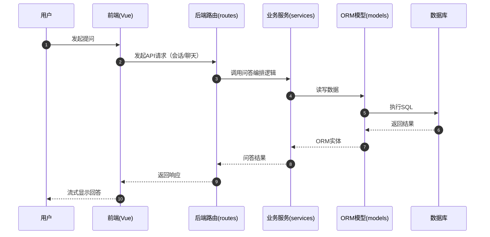
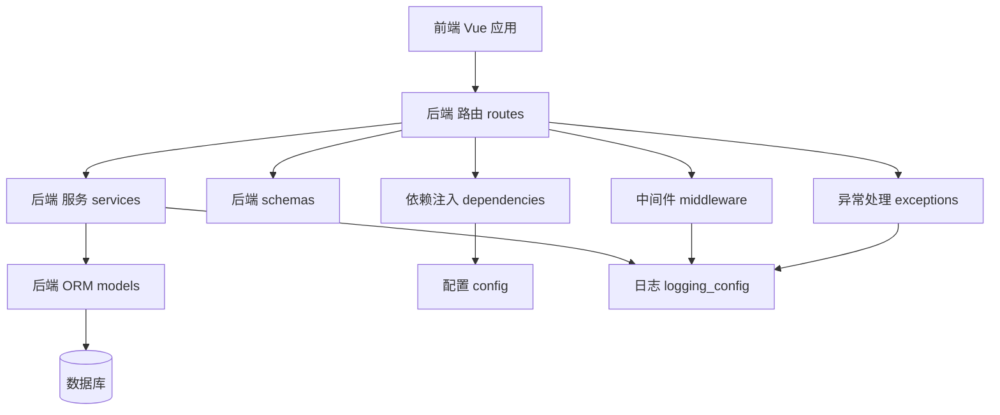
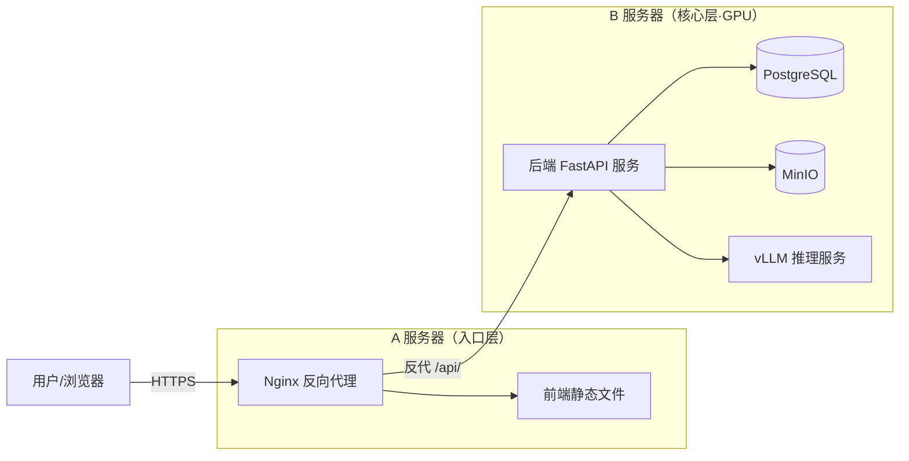
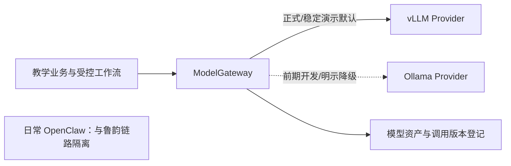

# 架构概览

本文档说明当前问答 MVP 的后端、前端和部署结构。教学设计、诊断、ModelGateway、多智能体、多模态及 Base-Spark 双环境属于目标架构，尚未在当前代码中实现。

> 基础设施与部署请参考：`src/infra/README.md`。
> 目标范围、阶段和验收请参考：`src/docs/2026-luyun-curriculum-pedagogy-development-plan.md`。

## 仓库结构

- 后端：`src/apps/api`（FastAPI + SQLAlchemy + Alembic）
- 前端：`src/apps/web`（Vue 3 + TypeScript + Vite + Vant）
- 脚本：`src/scripts`（导入/同步等工具脚本）

## 根目录 Python 文件

- `main.py` 是一个小型演示入口，不用于启动 API。
- API 入口为 `src/apps/api/main.py`。

## 后端结构

### 核心运行模块

- `src/apps/api/main.py`
  - 创建 FastAPI 应用
  - 注册中间件、异常处理器与路由
- `src/apps/api/config.py`
  - 加载环境配置与设置
- `src/apps/api/exceptions.py`
  - 定义 `BusinessError` 与全局异常处理器
- `src/apps/api/middleware.py`
  - Trace ID 中间件（为每个请求生成唯一标识，用于日志追踪与错误排查）
  - 请求日志中间件（记录请求方法、路径、状态码与耗时）
  - 认证上下文中间件（从 JWT 提取 user_id 到 request.state，供限流 key 使用，不做鉴权判定）
- `src/apps/api/logging_config.py`
  - Loguru 结构化日志配置
- `src/apps/api/dependencies.py`
  - 数据库会话与 JWT 鉴权的依赖注入
- `src/apps/api/rate_limit.py`
  - SlowAPI 限流配置

### 分层模块

- `src/apps/api/routes/*`
  - HTTP API 端点（auth/cases/sessions/chat）
  - 仅做请求校验、依赖注入与响应塑形
- `src/apps/api/services/*`
  - 业务逻辑与编排（例如 LLM 调用与提示词构建）
- `src/apps/api/schemas/*`
  - Pydantic 请求/响应模型
- `src/apps/api/models/*`
  - 映射到数据库表的 SQLAlchemy ORM 模型

## 后端调用链（典型请求流程）

1. 客户端向 `routes/*` 中的路由发起 HTTP 请求。
2. 路由使用 `schemas/*` 校验输入，并从 `dependencies.py` 注入依赖。
3. 路由调用 `services/*` 中的业务逻辑函数。
4. 服务使用 `models/*` 与异步 DB 会话并返回 schema 数据。
5. `exceptions.py` 统一处理错误；日志包含来自中间件的 trace ID。

## 前端结构

- 入口：`src/apps/web/src/main.ts` 挂载 Vue 应用。
- 应用外壳：`src/apps/web/src/App.vue` 与路由驱动页面。
- 路由：`src/apps/web/src/router/*` 定义路由与守卫。
- 状态：`src/apps/web/src/stores/*`（Pinia store）。
- API 层：`src/apps/web/src/api/*` 处理 HTTP 调用与鉴权。
- 类型：`src/apps/web/src/types/*` 共享 TypeScript API 模型。
- UI 组件：`src/apps/web/src/components/*` 以及 `src/apps/web/src/views/*` 下的页面。

## 前端调用链（典型页面流程）

1. 用户进入 `router/*` 定义的路由。
2. 页面组件加载并调用 `api/*` 中的 API helper。
3. API 层返回带类型的数据（`types/*`），必要时更新 Pinia store。
4. UI 使用组件与 Vant 组件渲染，并在出错时显示 toast/dialog。

## 交互时序图

描述鲁韵思政问答场景下的典型交互路径。



## 模块依赖图

描述后端核心模块之间的依赖与调用方向。



## 部署架构图

描述当前生产编排基线及其网络连接关系（A/B 双机部署）。



## 目标模型服务架构

当前 API 直接使用 `LLM_BASE_URL` 和 `LLM_MODEL` 请求 OpenAI 兼容接口。阶段 1 将引入 ModelGateway，使教学业务只使用逻辑模型名，不感知 vLLM 模型目录或 Ollama tag。



- 正式环境、`base-spark` 稳定演示环境和最终验收默认使用 vLLM。
- Ollama 仅用于前期开发、vLLM 兼容性验证期间的过渡和明确标注的备用 Provider。
- 标准模型资产登记来源版本、权重哈希、Tokenizer、Chat Template、许可证、量化和 Provider 模型 ID；Ollama tag 不是唯一资产来源。
- vLLM/Ollama Provider 切换不得改变教学成果 Schema、规则、任务状态和审计链路。

## Base-Spark 目标部署与晋级

`base-spark` 计划保留两套相互隔离的应用环境，共享经过配额和版本控制的模型服务：

```text
合并并通过自动测试
  → 部署 luyun-int
  → virtus 经 Tailscale 端到端验证
  → 专业、安全、迁移和回滚门禁
  → 同一镜像摘要晋级 luyun-demo
```

- `luyun-int` 高频接收可运行增量，用于联调、迁移、Provider 切换和故障测试。
- `luyun-demo` 只接收通过门禁的不可变镜像，始终保留上一稳定版本和数据快照，禁止日常开发直接覆盖。
- 每个可验收开发节点都必须完成部署与 `virtus` 验证；G1–G4 分别保留可回滚演示版本。
- 该双环境尚未落地，现有 `dev.yml` 和 `prod-b.yml` 仍是当前基线，不代表 Base-Spark 目标编排已经完成。

## 一句话总结

当前由 `main.py` 串联配置、中间件、异常与路由，前端消费问答 API 并以 SSE 流式呈现；后续按开发计划逐步加入领域工作流、ModelGateway 和双环境持续部署。
