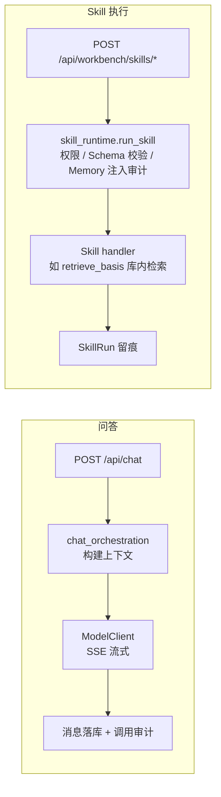
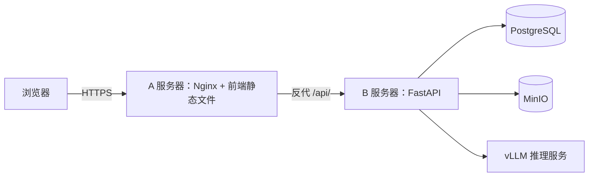

# 架构说明

本文说明当前代码的组织方式和调用链，并标出与目标架构的边界。
范围与阶段以[主开发计划](2026-luyun-curriculum-pedagogy-development-plan.md)（v1.0）为准；部署操作见 [src/infra/README.md](../infra/README.md)。

## 代码组织

| 位置 | 职责 |
| --- | --- |
| `src/apps/api/main.py` | 应用入口：中间件、异常处理、路由注册、启动恢复 |
| `src/apps/api/routes/` | HTTP 层（auth / cases / sessions / chat / workbench），保持薄层 |
| `src/apps/api/services/` | 业务层：问答编排、ModelClient、项目、知识处理、Skills 运行时、Memory |
| `src/apps/api/schemas/` | Pydantic 请求/响应与 Skill 输入输出契约 |
| `src/apps/api/models/` | SQLAlchemy ORM（含 SkillDefinition 与 Memory 对象） |
| `src/apps/api/migrations/` | Alembic 迁移 |
| `src/apps/web/src/` | 前端：`api/` 请求封装、`views/` 页面、`stores/` 状态、`types/` 类型 |

支撑模块：`config.py`（环境配置，导入时生效）、`dependencies.py`（DB 会话与 JWT 鉴权）、`middleware.py`（Trace ID、请求日志）、`exceptions.py`（统一错误）、`rate_limit.py`（限流）、`logging_config.py`（结构化日志）。

## 请求如何流转

一次典型请求：路由校验入参并注入依赖 → 调用 services 完成业务 → ORM 读写 PostgreSQL → 统一异常与日志（带 trace_id）返回。

两条核心链路：



要点：

- **Skill 执行只有一个入口**：`skill_runtime.run_skill`。它负责权限检查、输入输出 Schema 校验、`input_hash`、Memory 注入审计和 SkillRun 生命周期；业务 handler 只做领域逻辑。
- **Memory 不走暗道**：只有用户显式传入的 `memory_refs` 会被解析，解析前校验归属并写 `MemoryInjectionAudit`；已清除的引用会被拒绝。
- **检索在数据库内完成**：`retrieve_basis` 用 pg_trgm 相似度在 PostgreSQL 内排序过滤，低于阈值时返回"资料不足"，不伪造依据。
- **模型调用只认逻辑模型名**：ModelClient 屏蔽 Ollama / OpenAI 兼容接口差异并记录调用审计；换 Provider 不改业务代码。
- **后台任务可恢复**：资料解析任务状态存库，应用重启后由 lifespan 自动恢复。

## 部署形态

当前生产基线（A/B 双机）：



`base-spark` 集成环境（`luyun-int`）：host network 但服务只绑定 `127.0.0.1` 独立端口，Tailscale Serve 将 Tailnet HTTPS 反代到 Web 入口。发布节奏：

```text
合并并通过自动测试 → 部署 luyun-int → Virtus 端到端验证
  → 专业/安全/迁移/回滚门禁 → 同一镜像晋级 luyun-demo（未建成）
```

当前 Provider 为 Ollama `qwen3.5:27b`（明示过渡）；固定版本 vLLM 验证（D0）与 `luyun-demo` 尚未完成。

## 当前实现 vs 目标架构

| 组件 | 当前状态 | 目标（阶段） |
| --- | --- | --- |
| 检索 | pg_trgm 库内词法检索 + 资料不足阈值 | 全文 + 向量混合检索、Reranker、页码级引用（1B） |
| Skills | 运行时最小集，仅 `retrieve_basis` v1.1.0 达基线；配额/降级字段已登记未启用 | 阶段 1 全部 Skills 注册，配额与降级策略生效（1B） |
| Memory | 偏好 + 班情 + 注入审计 + 清除/导出 | 注入确认 UX、模板钉选、与生成类 Skills 联动（1B–2） |
| 模型服务 | 最小 ModelClient（逻辑模型名 + 调用审计） | 完整 ModelGateway：注册、路由、能力发现、Provider 一致性回归 |
| 教学成果 | 项目/版本骨架（content 为自由 JSON） | 结构化教学设计 Schema、生成/诊断/导出闭环（1B–2） |
| 身份 | 本地 JWT 登录（过渡） | 校验思政课平台签发的 claims，本仓不做注册/KYC（计划 §2.6） |
| 多智能体 / 多模态 | 未开始 | 阶段 4 门禁式交付，Agent 只能调用 Skills 注册表 |

其余阶段 1 Skills 的输入输出 Schema 属阶段 0《产品 Skills 目录 v1》冻结范围，未冻结前不在代码内发明契约。

## 阶段 1 工程顺序（计划 §5.4.1 摘要）

```text
1 领域对象 → 2 服务层抽离 → 3 ModelClient → 4 异步任务 → 5 RAG/retrieve_basis
→ 6 Skills 运行时 → 7 Memory 最小集 → 8 样板生成-诊断-导出 → 9 桌面工作台 → 10 双环境晋级
```

当前位置：第 1–7 步已有最小基线（第 5 步的向量腿待 D0 选型），第 8 步起未开始。

## 一句话总结

问答链路、教学项目/资料/任务、库内检索、Skills 运行时和 Memory 最小集已在 `luyun-int` 共同运行；接下来按计划补齐向量检索、纵向样板、完整 ModelGateway 和 `luyun-demo` 晋级。
