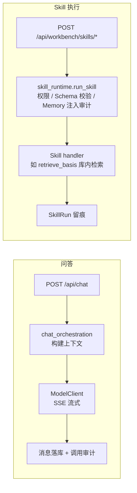
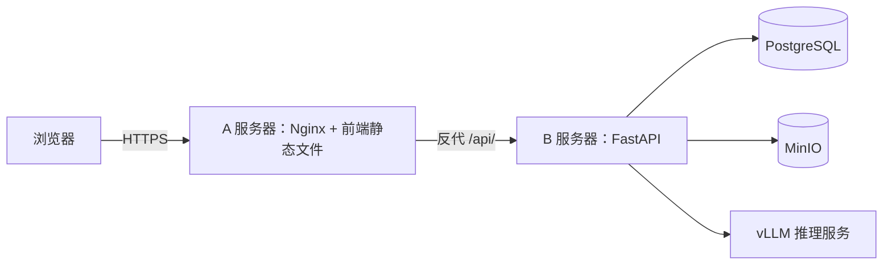

# 架构说明

本文说明当前代码的组织方式和调用链，并标出与目标架构的边界。
范围与阶段以[主开发计划](2026-luyun-curriculum-pedagogy-development-plan.md)（v1.0）为准；部署操作见 [src/infra/README.md](../infra/README.md)。

## 代码组织

| 位置 | 职责 |
| --- | --- |
| `src/apps/api/main.py` | 应用入口：中间件、异常处理、路由注册、启动恢复 |
| `src/apps/api/routes/` | HTTP 层（auth / cases / sessions / chat / workbench），保持薄层 |
| `src/apps/api/services/` | 业务层：问答编排、模型/检索 Provider Adapter、项目、知识处理、Skills、Memory、评测、纵向样板与导出 |
| `src/apps/api/schemas/` | Pydantic 请求/响应与 Skill 输入输出契约 |
| `src/apps/api/models/` | SQLAlchemy ORM（含 SkillDefinition 与 Memory 对象） |
| `src/apps/api/migrations/` | Alembic 迁移 |
| `src/apps/web/src/` | 前端：`api/` 请求封装、`views/` 页面、`stores/` 状态、`types/` 类型 |

支撑模块：`config.py`（环境配置，导入时生效）、`dependencies.py`（DB 会话与 JWT 鉴权）、`middleware.py`（Trace ID、请求日志）、`exceptions.py`（统一错误）、`rate_limit.py`（限流）、`logging_config.py`（结构化日志）。

## 请求如何流转

一次典型请求：路由校验入参并注入依赖 → 调用 services 完成业务 → ORM 读写 PostgreSQL → 统一异常与日志（带 trace_id）返回。

两条核心链路：



要点：

- **Skill 执行只有一个入口**：`skill_runtime.run_skill`。它负责权限检查、输入输出 Schema 校验、`input_hash`、Memory 注入审计和 SkillRun 生命周期；业务 handler 只做领域逻辑。
- **Memory 不走暗道**：只有用户显式传入的 `memory_refs` 会被解析，解析前校验归属并写 `MemoryInjectionAudit`；已清除的引用会被拒绝。
- **检索可降级且可追溯**：`retrieve_basis` 合并 pg_trgm 与 pgvector 候选，再由固定 revision Reranker 重排；语义 Provider 失败时显式回退字符 n-gram 链。索引只在完整构建后原子激活。
- **评测可复现**：工程数据集冻结后记录内容哈希；每次运行保存应用、vLLM、模型 revision、检索参数和 Skill 版本清单。正式来源数据集还经过批量导入、双专家独立复核、第三人仲裁和占位案例门禁。这里只判断技术预期命中，不输出教师或学生分数。
- **模型调用只认逻辑模型名**：Ollama 与 OpenAI-compatible/vLLM Provider Adapter 屏蔽接口差异并记录调用审计；换 Provider 不改业务代码。
- **样板版本不可变**：对齐卡、蓝图、课时设计、结构确认、诊断决定和采纳项修订都形成新的 ProjectVersion；`apply_revision` 只读取明确采纳项并尊重字段锁定；前端按最新版本中的前置成果逐级解锁。
- **后台任务可恢复**：资料解析任务状态存库，应用重启后由 lifespan 自动恢复。

## 部署形态

当前生产基线（A/B 双机）：



`base-spark` 集成环境（`luyun-int`）：host network 但服务只绑定 `127.0.0.1` 独立端口，Tailscale Serve 将 Tailnet HTTPS 反代到 Web 入口。发布节奏：

```text
合并并通过自动测试 → 部署 luyun-int → 工程端到端验证
  → 模拟数据/安全/迁移/回滚门禁 → 同一镜像晋级 luyun-demo
  → 替换真实资料与专家回归 → Virtus 人工验收 → G1
```

`luyun-int` 与 `luyun-demo` 的问答、Embedding 和 Reranker 均使用固定版 vLLM 0.18.0 工程候选，通过相互隔离的 loopback 端口接入；Ollama 只保留为明示备用。两套环境共享同一不可变应用镜像，但使用独立数据库、对象存储、模型缓存和 Secret。候选模型专业冻结尚未完成。

## 当前实现 vs 目标架构

| 组件 | 当前状态 | 目标（阶段） |
| --- | --- | --- |
| 检索 | pg_trgm + pgvector + Reranker，字符向量显式降级，索引版本追溯；64 个模拟案例工程回归 | 专家冻结模型/阈值、页码级引用（G0/1B） |
| 评测来源 | 来源标记、外部审核、批量导入、双评/第三人仲裁、占位案例防冻结和模拟集防误批门禁 | 导入 120–160 个真实专家金标、冻结专业阈值并签字 |
| Skills | 八个产品 Skill 统一运行、版本与降级契约，含证据化诊断和仅采纳项修订 | 专家冻结的完整目录、正式额度与质量门禁 |
| Memory | 偏好 + 班情 + 钉选 + 显式界面确认 + 审计/清除/导出 | 保留/删除 SLA、授权共享模板（阶段 2–3） |
| 模型服务 | 逻辑模型名 + Provider Adapter + 固定 vLLM/模型资产登记 | 完整能力路由、Provider 一致性和专业选型门禁 |
| 教学成果 | 高中议题式结构化生成、字段锁定、局部重生成/差异、结构校正、证据化诊断、逐条决定、仅采纳项修订、五类配套成果与 `word-standard-v2` 导出 | 客户专属模板、分学段正式量规和其他学段扩展 |
| 身份 | 本地 JWT 登录（过渡） | 校验思政课平台签发的 claims，本仓不做注册/KYC（计划 §2.6） |
| 多智能体 / 多模态 | 未开始 | 阶段 4 门禁式交付，Agent 只能调用 Skills 注册表 |

当前六个 Skill 的工程契约见《阶段 1 工程冻结基线》；专家与客户未签字前只作为技术样板，不构成 G0/G1 通过。

## 阶段 1 工程顺序（计划 §5.4.1 摘要）

```text
1 领域对象 → 2 服务层抽离 → 3 ModelClient → 4 异步任务 → 5 RAG/retrieve_basis
→ 6 Skills 运行时 → 7 Memory 最小集 → 8 样板生成-诊断-导出 → 9 桌面工作台 → 10 双环境晋级
```

当前位置：第 1–9 步已有单一高中议题式技术样板；第 10 步的模拟工程回归、金标治理工具和 `luyun-demo` 同镜像晋级已完成。真实资料、真实专家金标、专业模型冻结和 Virtus 人工验收未完成，因此第 10 步的正式 G1 门禁仍未关闭。

## 一句话总结

问答兼容链路、高中议题式纵向样板、版本化语义 RAG、模拟评测、金标双评/仲裁工具、诊断规则字典 v2、结构化生成和双环境晋级已同构。当前采用自助开发 + 投标演示优先顺序：先完成桌面 Web 的诊断、运营、安全、增强能力和可回滚演示基线，真实用户/专家验证后置；小程序只保留接口约束，待核心 Web 与阶段 4 增强稳定后作为全计划最后实施包。正式 G1/G2/G3/G4 门槛仍需按主计划完成真实资料、专家回归、客户确认和外部验收。
