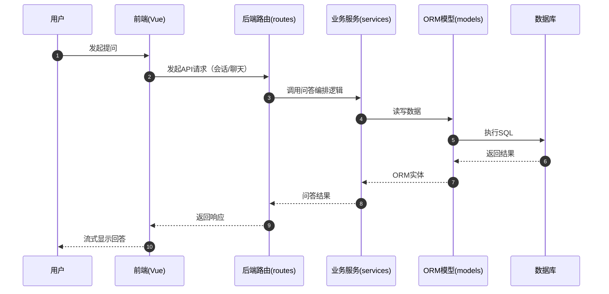
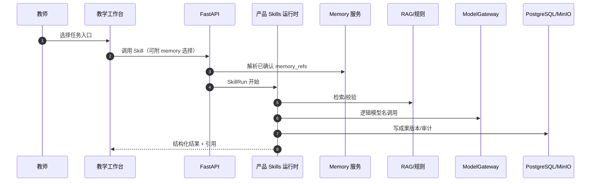
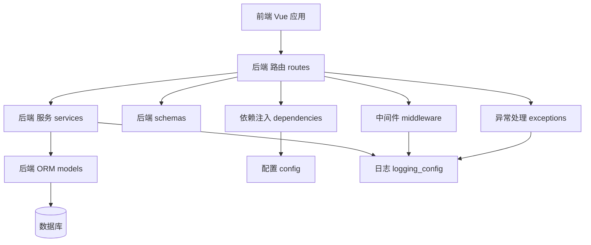
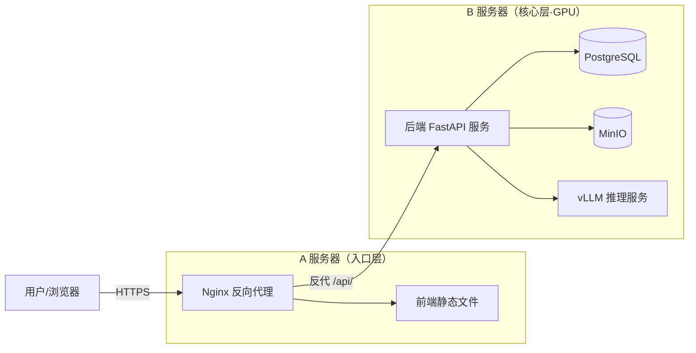
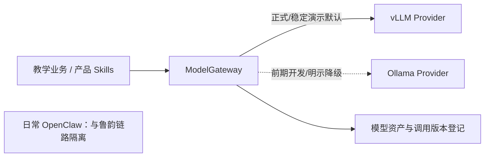
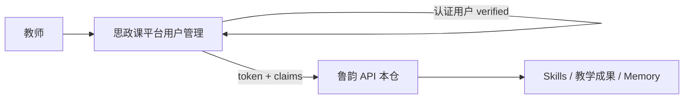

# 架构概览

本文档说明**问答 MVP + 阶段 1A 首个可部署增量**的后端、前端和部署结构，并摘要**目标架构**中与开发计划一致的关键点。

> 范围、阶段、验收、产品 Skills、核心用户 Memory、用户注册/认证分级与工程顺序以  
> `src/docs/2026-luyun-curriculum-pedagogy-development-plan.md`（v1.0）为唯一主依据。
> 当前已实现项目/版本、资料/任务、`retrieve_basis` 基线、最小 ModelClient、工作台基础页和 `luyun-int`；完整教学设计/诊断、Skills 运行时、Memory、完整 ModelGateway、多智能体、多模态及 `luyun-demo` 仍属目标能力。
> **用户注册与认证升级在思政课平台用户管理实现，不在本仓库。**  
> 基础设施与部署请参考：`src/infra/README.md`。

## 仓库结构

- 后端：`src/apps/api`（FastAPI + SQLAlchemy + Alembic）
- 前端：`src/apps/web`（Vue 3 + TypeScript + Vite + Vant）
- 脚本：`src/scripts`（导入/同步等工具脚本）
- 计划与规格：`src/docs/`

API 入口为 `src/apps/api/main.py`（根目录不再保留演示入口脚本）。

## 后端结构（当前）

### 核心运行模块

- `src/apps/api/main.py`：创建 FastAPI 应用，注册中间件、异常处理器与路由
- `src/apps/api/config.py`：环境配置
- `src/apps/api/exceptions.py`：`BusinessError` 与全局异常处理
- `src/apps/api/middleware.py`：Trace ID、请求日志、认证上下文（供限流，不做鉴权判定）
- `src/apps/api/logging_config.py`：Loguru 结构化日志
- `src/apps/api/dependencies.py`：数据库会话与 JWT 鉴权
- `src/apps/api/rate_limit.py`：SlowAPI 限流

### 分层模块

- `src/apps/api/routes/*`：HTTP API（auth/cases/sessions/chat/workbench）
- `src/apps/api/services/*`：审计、问答编排、最小 ModelClient、教学项目和知识处理；HTTP 路由保持输入/权限/响应编排薄层
- `src/apps/api/schemas/*`：Pydantic 模型
- `src/apps/api/models/*`：SQLAlchemy ORM

## 后端调用链（当前典型请求）

1. 客户端向 `routes/*` 发起 HTTP 请求。
2. 路由使用 `schemas/*` 校验输入，并从 `dependencies.py` 注入依赖。
3. 路由调用 `services/*` 完成问答、项目和知识处理；后台资料任务由应用进程恢复并执行。
4. 使用 `models/*` 与异步 DB 会话。
5. `exceptions.py` 统一错误；日志含 trace ID。

## 前端结构（当前）

- 入口：`src/apps/web/src/main.ts`
- 路由：`src/apps/web/src/router/*`
- 状态：`src/apps/web/src/stores/*`
- API：`src/apps/web/src/api/*`
- 页面：登录 / 主题列表 / 问答 / 历史会话（兼容入口）+ 工作台（项目、版本、资料、任务、依据检索）

> 目标前端为**桌面优先教学工作台**（成果编辑、诊断对照、版本 diff、Memory 管理）。Vant 手机组件叙事不作为备课主路径的长期形态。

## 交互时序图（当前问答）



## 目标业务调用链（计划，Skills + Memory）



## 模块依赖图（当前）



## 部署架构图（当前生产基线 A/B）



## 当前最小模型客户端与目标网关

当前 API 已通过最小 ModelClient 读取逻辑模型名、Provider 和 Provider 模型 ID，兼容 Ollama 原生流式接口与 OpenAI 兼容接口，并记录延迟、token 估算、状态和错误码。完整 ModelGateway 的模型注册、能力发现、任务路由和 Provider 一致性回归仍待建设。



- 正式环境、`base-spark` 稳定演示环境和最终验收默认使用 vLLM。
- Ollama 仅用于前期开发、vLLM 兼容性验证期间的过渡和明确标注的备用 Provider。
- Provider 切换不得改变教学成果 Schema、Skill 契约、规则、任务状态和审计链路。

## 目标：产品 Skills 与 Memory（计划）

| 组件 | 职责 | 阶段 |
| --- | --- | --- |
| SkillDefinition / SkillRun | 版本化任务技能、Schema、配额、审计 | 1 必交最小集 |
| UserPreference / ClassContextProfile | 显式工作记忆，可删可审计 | 1 最小集 |
| MemoryInjectionAudit | 记录注入到某次 SkillRun 的记忆引用 | 1 |
| Agent DAG | 只调用 Skills 白名单，不另开写接口 | 4 门禁交付 |

禁止：教师/学生总分排名、思想侧写式长期记忆、开放插件式任意 Skill。

## 目标：身份与登录边界（计划）



| 级别 | 达成条件 | 实现系统 |
| --- | --- | --- |
| 注册用户 | 手机验证 + 姓名 + 工作单位（步骤 1–4） | 平台用户管理 |
| 认证用户 | 步骤 5：SSO / 合规核身 / 邀请或通讯录等 | 平台用户管理 |

- 本仓当前：本地 JWT 登录（MVP）。
- 本仓目标：校验平台签发身份；**不实现**短信注册与 KYC。
- 默认不采集未核验身份证号。详见开发计划 §2.6。

## 阶段 1 工程落地顺序（摘要）

详见开发计划 §5.4.1：

1. Teaching Project / Version  
2. 服务层抽离  
3. ModelClient  
4. 异步任务  
5. RAG / `retrieve_basis`  
6. Skills 运行时  
7. Memory 最小集  
8. 样板生成—诊断—导出  
9. 桌面优先工作台  
10. 双环境晋级  

## Base-Spark 当前部署与目标晋级

```text
合并并通过自动测试
  → 部署 luyun-int
  → virtus 经 Tailscale 端到端验证
  → 专业、安全、迁移和回滚门禁
  → 同一镜像摘要晋级 luyun-demo
```

- 已落地 `luyun-int`：`base-spark.yml` 使用 host network，但 Web/API/PostgreSQL/MinIO 只绑定 `127.0.0.1` 的独立端口。
- Tailscale Serve 将 Tailnet HTTPS `:443` 代理到 Web `127.0.0.1:8088`；2026-07-15 已从 Virtus 验证登录和 SSE 问答。
- 当前 Provider 为 Ollama `qwen3.5:27b`，属于明示过渡状态；固定版本 vLLM D0 尚未完成。
- `luyun-demo`、同镜像摘要晋级、独立数据快照及一键回滚尚未落地，不能将 `luyun-int` 宣称为稳定演示或客户生产环境。
- 演示脚本只能覆盖已实现能力；完整 Skills/Memory/Agent 未就绪时不得伪装。

## 一句话总结

当前已从单一问答 MVP 前进到可部署的阶段 1A 工程骨架：问答兼容链路、Teaching Project/Version、知识审核检索基线、任务审计、最小 ModelClient 和桌面工作台共同运行在 `luyun-int`；后续继续补齐混合 RAG、Skills/Memory、纵向样板、完整 ModelGateway 和 `luyun-demo` 晋级。
